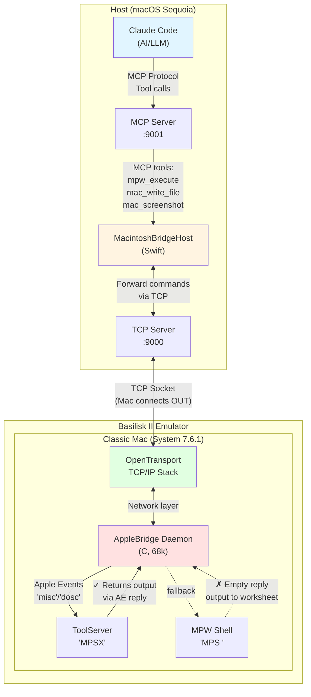
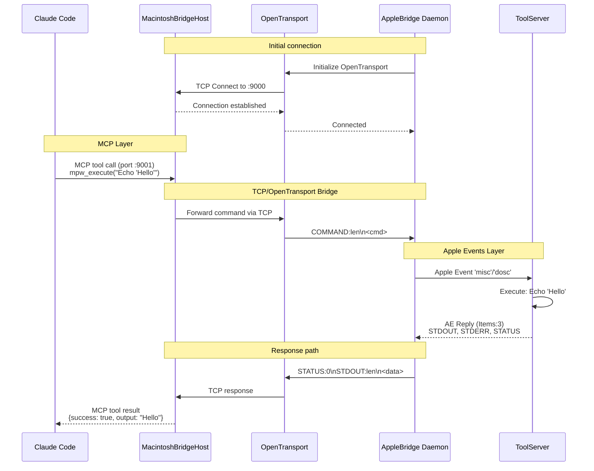

# AppleBridge

Connect Claude AI to classic Macintosh MPW shell running in Basilisk II emulator.

## Current Status: WORKING

- TCP bridge: **WORKING** - Mac daemon connects to host
- Apple Events: **WORKING** - Commands execute in MPW Shell
- Remote compilation: **WORKING** - SC compiler creates .o files
- Encoding conversion: **WORKING** - UTF-8 ↔ MacRoman converter
- Screenshot capture: **WORKING** (host-side, captures Basilisk II window)

## Architecture



### Communication Flow - Dual Connection Paradigm



**Key Design - Dual Connection Paradigm**:

1. **MCP Layer (Port 9001)**: Claude Code → MacintoshBridgeHost via MCP protocol
   - Standardized AI tool interface
   - Tools: `mpw_execute`, `mac_write_file`, `mac_screenshot`, etc.

2. **TCP/OpenTransport Layer (Port 9000)**: Mac daemon → MacintoshBridgeHost
   - Mac connects OUT (reversed client-server)
   - Solves Basilisk II MACNAT limitation (incoming connections blocked)
   - OpenTransport provides TCP/IP on System 7.6.1

3. **Apple Events Layer**: AppleBridge → ToolServer/MPW Shell
   - Classic Mac IPC for command execution

**Critical**: Use **ToolServer** for automation - MPW Shell returns empty AE replies!

## Quick Start

### 1. Host Side (MacintoshBridgeHost)

**Option A: Via MCP (Recommended - with Claude Code)**

The MCP server runs automatically when configured in `.mcp.json`. MacintoshBridgeHost provides:
- **Port 9001**: MCP server (receives commands from Claude Code)
- **Port 9000**: TCP server (receives connection from Mac daemon)

**Option B: Standalone (for testing)**

```bash
cd host/
python3 host_server.py
```

Output:
```
=== AppleBridge Host Server ===
Listening on port 9000
Configure Mac to connect to: 192.168.x.x:9000
Waiting for Mac to connect...
```

### 2. Mac Side (Basilisk II)

Requirements:
- System 7.6.1 with Open Transport
- MPW Golden Master
- 68k Compiler: SC, Linker: **Link** (not ILink - crashes emulator) with `-model far`

**IMPORTANT**: Convert files before copying to Mac:
```bash
cd host/
uv run python encoding_convert.py to-share ../mac/
```

Edit `src/main.c` to set your host IP:
```c
char hostIPStr[] = "192.168.3.154";  /* Your host IP */
```

Build in MPW:
```
Directory AppleBridge:
Make -f Makefile.68k
```

### 3. Launch

1. Start MPW Shell first (required for Apple Events)
2. Double-click AppleBridge application
3. Status window shows: "Connecting to host..."
4. On success: "Connected to host!"

### 4. Test

**With MCP (Claude Code):**
```python
# Claude automatically uses MCP tools:
# mcp__applebridge__mpw_execute
# mcp__applebridge__mac_write_file
# mcp__applebridge__mac_read_file
# mcp__applebridge__mac_screenshot
# etc.
```

**Standalone (host_server.py interactive mode):**
```
Command> Echo "Hello from Claude"
Response:
STATUS:0
STDOUT:17
Hello from Claude
STDERR:0
```

## MCP Configuration

To use AppleBridge with Claude Code, configure `.mcp.json`:

```json
{
  "mcpServers": {
    "applebridge": {
      "command": "/path/to/MacintoshBridgeHost.app/Contents/MacOS/MacintoshBridgeHost",
      "args": []
    }
  }
}
```

**Available MCP Tools:**
- `mpw_execute` - Execute MPW/ToolServer commands
- `mac_write_file` - Write text files (MacRoman conversion)
- `mac_read_file` - Read text files (UTF-8 conversion)
- `mac_list_files` - Directory listings
- `mac_compile` - SC compiler wrapper
- `mac_screenshot` - Capture emulator window

See [ARCHITECTURE.md](ARCHITECTURE.md) for detailed explanation of the MCP + OpenTransport dual paradigm.

## Character Encoding

**CRITICAL**: Files must be converted between host (UTF-8) and Mac (MacRoman):

```bash
# Use the encoding converter script:
cd host/
uv run python encoding_convert.py to-mac source.txt ~/Desktop/Share/dest.txt
uv run python encoding_convert.py from-mac ~/Desktop/Share/file.txt ./file.txt

# Shortcut to Share folder:
uv run python encoding_convert.py to-share Makefile.68k
```

**Key character mappings:**
| Char | UTF-8 bytes | MacRoman | MPW use |
|------|-------------|----------|---------|
| ∂ | e2 88 82 | b6 | Line continuation |
| ƒ | c6 92 | c4 | Folder in paths |
| ≈ | e2 89 88 | c7 | Wildcard |

**Line endings:**
- Mac uses CR (`\r`, 0x0D)
- Host uses LF (`\n`, 0x0A)
- Converter handles both directions automatically

## Files

### mac/

| File | Description |
|------|-------------|
| `src/main.c` | Main daemon, event loop, status window |
| `src/network.c` | Open Transport TCP client |
| `src/command.c` | Apple Events to MPW Shell |
| `src/screenshot.c` | ScreenBits capture |
| `src/protocol.c` | Protocol parsing |
| `src/mystring.c` | Custom string functions (no StdCLib) |
| `include/applebridge.h` | Main header |
| `include/mystring.h` | String function prototypes |
| `Makefile.68k` | MPW Makefile |

### MacintoshBridgeHost/ (MCP Server)

| File | Description |
|------|-------------|
| `MacintoshBridgeHost/AppDelegate.swift` | Main MCP server app |
| `MacintoshBridgeHost/LocalControlServer.swift` | TCP bridge (port 9001 MCP, port 9000 Mac) |
| `MacintoshBridgeHost/TCPServer.swift` | TCP server implementation |
| `MacintoshBridgeHost/CommandHandler.swift` | MCP command routing |

### mcp/ (Python MCP Tools)

| File | Description |
|------|-------------|
| `mcp/server.py` | MCP server implementation |
| `mcp/tools.py` | MCP tool definitions (mpw_execute, etc.) |
| `mcp/mac_connection.py` | TCP client to MacintoshBridgeHost |

### host/ (Standalone Testing)

| File | Description |
|------|-------------|
| `host_server.py` | TCP server with interactive mode (standalone testing) |
| `encoding_convert.py` | UTF-8 ↔ MacRoman converter with line ending conversion |
| `test_commands.py` | Automated test script for MPW commands |
| `screenshot.py` | Capture Basilisk II window (host-side, uses Quartz) |

## Technical Notes

### MPW Makefile
- Use **TAB** characters (not spaces)
- Special chars: `ƒ` (Option-f) for dependencies, `∂` (Option-d) for continuation

### Libraries
```
OpenTransport.o OpenTransportApp.o OpenTptInet.o Interface.o MacRuntime.o
```

**Note**: StdCLib.o removed - causes undefined symbol errors.

### Apple Events
Finds MPW Shell (`'MPS '`) or ToolServer (`'MPSX'`), sends `'misc'/'dosc'` event.

### Protocol

Request: `COMMAND:<length>\n<command>` (note: uses `\n` as separator)

Response:
```
STATUS:<code>
STDOUT:<length>
<data>
STDERR:<length>
<data>

```

Screenshot: `SCREENSHOT` -> `IMAGE:<w>:<h>:BMP:<size>\r<data>`

## Key Fixes (2026-04-06)

### Apple Events -903 Error - FIXED

The -903 (`noPortErr`) error was caused by two issues:

**1. Missing SIZE resource flags:**

Create `AppleBridge.r`:
```c
resource 'SIZE' (-1) {
    /* ... other flags ... */
    isHighLevelEventAware,      /* REQUIRED for Apple Events! */
    localAndRemoteHLEvents,     /* Accept events from other apps */
    512 * 1024,    /* preferred size */
    256 * 1024     /* minimum size */
};
```

Add to application after linking:
```
Rez AppleBridge.r -a -o :bin:AppleBridge
```

**2. Wrong event loop function:**

Must use `WaitNextEvent` (not `GetNextEvent`) and handle high-level events:
```c
if (WaitNextEvent(everyEvent, &event, 1, NULL)) {
    if (event.what == kHighLevelEvent) {
        AEProcessAppleEvent(&event);
    }
}
```

### Shared Folder Limitation

- **Host path**: `/Users/pitforster/Desktop/Share`
- **Mac path**: `Unix:` (NOT "Share:")
- **Read-only from Mac side** - can read files but can't compile from there

**Solution:** Copy files to Mac local storage first:
```
Duplicate Unix:source.c MeinMac:MPW:Project:source.c
SC MeinMac:MPW:Project:source.c
```

### ILink vs Link

- **ILink**: Modern linker but **crashes Basilisk II frequently**
- **Link**: Older linker, **more stable on emulator - use this one**

```
Link -model far -o :bin:MyApp :obj:main.o "{LIBS}CLibraries:StdCLib.o" "{LIBS}Libraries:Interface.o" "{LIBS}Libraries:MacRuntime.o"
```

## ToolServer vs MPW Shell

**CRITICAL**: Reading command output via AppleBridge **only works with ToolServer**.

| Feature | MPW Shell ('MPS ') | ToolServer ('MPSX') |
|---------|-------------------|---------------------|
| Executes commands | ✓ | ✓ |
| Output visible | Worksheet only | Via Apple Events |
| AE reply Items | 0 (empty) | 3 (has data) |
| Automation | Blind (no feedback) | **Full feedback** ✓ |

**ToolServer output capture verified:**
| Command | Output Captured |
|---------|-----------------|
| `Directory` | ✓ Returns current path |
| `Files`, `Files -l` | ✓ Returns file listings |
| `Echo` | ✓ Returns text |
| `SC` (compile) | Silent on success (check for .o file) |

The daemon automatically prefers ToolServer if running. **Start ToolServer for automation!**

## Known Limitations

1. **Single connection**: Only one Mac client at a time
2. Struct members named `outData`/`errData` (not stdout/stderr - reserved in MPW)
3. Some MPW tools write directly to worksheet (not captured even with ToolServer)

## Screenshot

Screenshots are captured from the **host side** (not Mac side) - System 7.6.1 lacks screenshot capabilities.

```bash
python3 host/screenshot.py [output.png]
```

Uses macOS Quartz to find Basilisk II window and capture via `screencapture -R`.

## License

Educational and development purposes.
