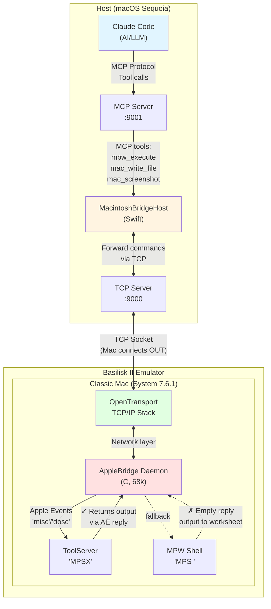
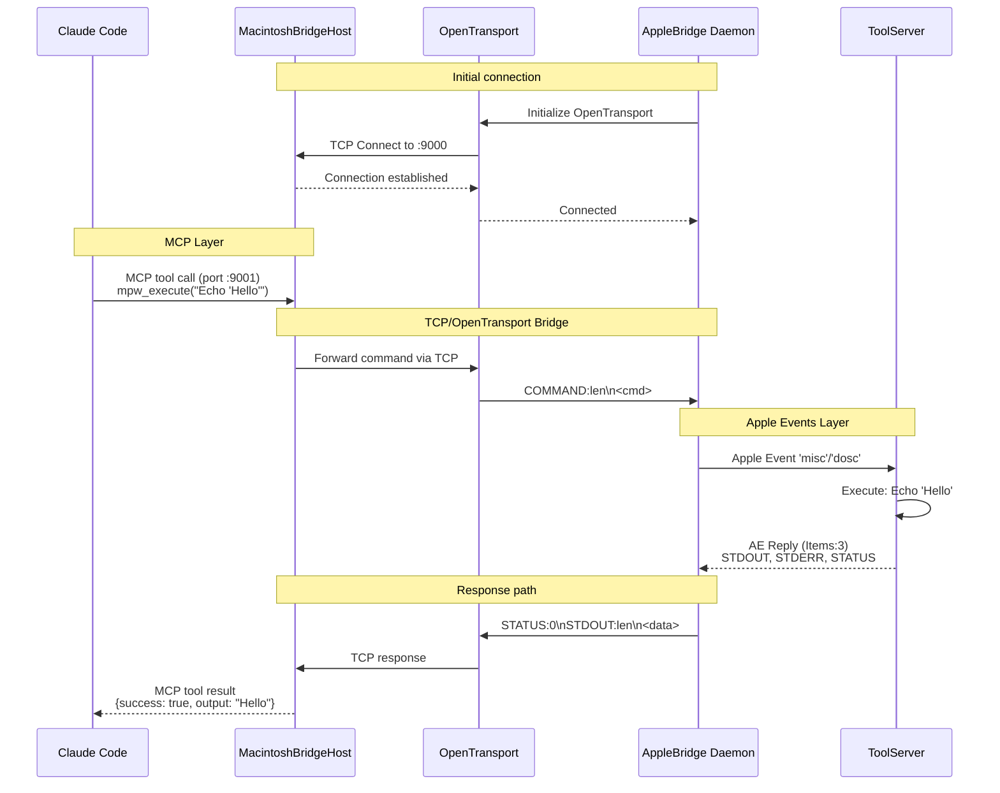

# AppleBridge

**AI-powered development for classic 68k Macintosh systems.**

AppleBridge connects Claude Code to an authentic Mac System 7.6.1 environment running in Basilisk II, enabling you to build, compile, and run classic Mac applications using natural language.

## What You Can Do

```
You: "Create a counter app that counts from 0 to 20"
Claude: [Writes C code, compiles with SC, links, and runs on System 7.6.1]
Result: Classic Mac app running in authentic 1990s environment
```

**Examples:**
- **Build classic Mac apps** - Claude writes, compiles, and tests 68k code
- **Develop in assembly** - Create apps using MPW assembler with AI assistance
- **Automate MPW workflows** - Compile, link, and execute remotely
- **Debug with feedback** - Full command output capture via ToolServer
- **Learn retro programming** - AI tutor for 68k assembly and Toolbox APIs

## Architecture



### Communication Flow



### Three-Layer Design

1. **MCP Layer** - Claude Code ↔ MacintoshBridgeHost (port 9001)
   - Standardized AI tool interface
   - Tools: `mpw_execute`, `mac_write_file`, `mac_screenshot`, etc.

2. **TCP/OpenTransport Layer** - Mac daemon ↔ MacintoshBridgeHost (port 9000)
   - Reversed architecture: Mac connects OUT to host
   - Solves Basilisk II NAT limitation
   - OpenTransport provides TCP/IP on System 7.6.1

3. **Apple Events Layer** - AppleBridge ↔ ToolServer/MPW Shell
   - Classic Mac IPC for command execution
   - ToolServer returns output, MPW Shell doesn't (use ToolServer!)

## Quick Start

### Prerequisites

**Host (macOS):**
- Basilisk II emulator configured and running
- MacintoshBridgeHost built (Xcode project included)
- Claude Code with MCP configured

**Mac (Basilisk II):**
- System 7.6.1 with OpenTransport installed
- MPW Golden Master
- ToolServer running (for command output capture)
- Network configured (DHCP or manual IP)

### 1. Configure MCP

Edit `.mcp.json` in your project or `~/.claude/`:

```json
{
  "mcpServers": {
    "applebridge": {
      "command": "/path/to/MacintoshBridgeHost.app/Contents/MacOS/MacintoshBridgeHost",
      "args": []
    }
  }
}
```

### 2. Build Mac Daemon

Convert source files for Mac (handles encoding):
```bash
cd host/
uv run python encoding_convert.py to-share ../mac/
```

In Basilisk II, copy from `Unix:` volume to Mac storage and build:
```
Duplicate -y Unix:mac: MeinMac:MPW:AppleBridge:
Directory MeinMac:MPW:AppleBridge:
Make -f Makefile.68k
```

Edit `src/main.c` first to set your host IP address.

### 3. Launch

**On Mac:**
1. Start ToolServer (for automation feedback)
2. Double-click AppleBridge application
3. Watch for "Connected to host!" status

**On Host:**
MacintoshBridgeHost starts automatically via MCP.

### 4. Use with Claude Code

```
You: "Execute 'Directory' command on the Mac"
Claude: [Uses mcp__applebridge__mpw_execute tool]
Result: MeinMac:MPW:AppleBridge:

You: "Create a Hello World app"
Claude: [Writes hello.c, compiles, links, launches]
Result: Mac dialog showing "Hello, World!"
```

## Available MCP Tools

| Tool | Description |
|------|-------------|
| `mpw_execute` | Execute MPW/ToolServer commands |
| `mac_write_file` | Write text files (auto MacRoman conversion) |
| `mac_read_file` | Read text files (auto UTF-8 conversion) |
| `mac_list_files` | Directory listings |
| `mac_compile` | SC compiler wrapper |
| `mac_screenshot` | Capture emulator window |

## Project Structure

```
AppleBridge/
├── mac/                          # 68k Mac daemon (C)
│   ├── src/                      # Source files
│   └── Makefile.68k              # MPW makefile
├── MacintoshBridgeHost/          # Swift MCP bridge (Xcode)
│   └── MacintoshBridgeHost/      # Swift source
├── mcp/                          # Python MCP server (alternative)
│   ├── server.py
│   └── tools.py
└── host/                         # Utilities
    ├── encoding_convert.py       # UTF-8 ↔ MacRoman
    ├── screenshot.py             # Capture Basilisk II window
    └── host_server.py            # Standalone TCP server (testing)
```

## Documentation

- **[ARCHITECTURE.md](ARCHITECTURE.md)** - Detailed explanation of the MCP + OpenTransport dual paradigm
- **[SETUP.md](docs/SETUP.md)** - Complete setup guide with networking, libraries, and encoding
- **[TROUBLESHOOTING.md](TROUBLESHOOTING.md)** - Common issues, fixes, and known limitations
- **[ASSEMBLY_TEMPLATE.md](ASSEMBLY_TEMPLATE.md)** - 68k assembly programming guide

## Key Features

✅ **Full automation** - AI writes, compiles, and runs code on authentic Mac
✅ **Bidirectional communication** - Complete command/response feedback loop
✅ **Encoding handled** - Automatic UTF-8 ↔ MacRoman + line ending conversion
✅ **Network transparency** - Works through Basilisk II NAT
✅ **Visual feedback** - RX/TX LED activity indicators
✅ **Production ready** - Stable on System 7.6.1 with OpenTransport

## Example Workflow

```bash
# Claude Code session:
"Create a counter app in MeinMac:MPW:OurTest that counts 0-20"

# Behind the scenes:
1. Claude writes counter.c
2. Converts to MacRoman via mac_write_file
3. Compiles: SC counter.c -o counter.o
4. Links: Link counter.o Interface.o MacRuntime.o -o Counter
5. Sets type: SetFile -t APPL Counter
6. Launches: Counter
7. Reports success with screenshot

# Total time: ~30 seconds
# Your effort: One sentence
```

## Status

**Current Version:** 0.3.0 (with RX/TX health indicators)
**Status:** Production Ready ✅

All core features working:
- ✅ TCP bridge with automatic reconnection
- ✅ Apple Events command execution
- ✅ Remote compilation and linking
- ✅ MCP integration with Claude Code
- ✅ Encoding conversion (UTF-8 ↔ MacRoman)
- ✅ Screenshot capture

## Credits

**Built by:** Pit with love for 68K and Claude
**AI Assistant:** Claude Sonnet 4.5 (Anthropic)
**Technologies:** OpenTransport, MCP, Apple Events, MPW, System 7.6.1
**Platform:** Basilisk II emulator on macOS Sequoia

**"Connecting classic Mac to the future"** ✨

## License

Educational and development purposes.
