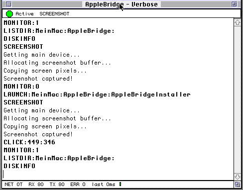
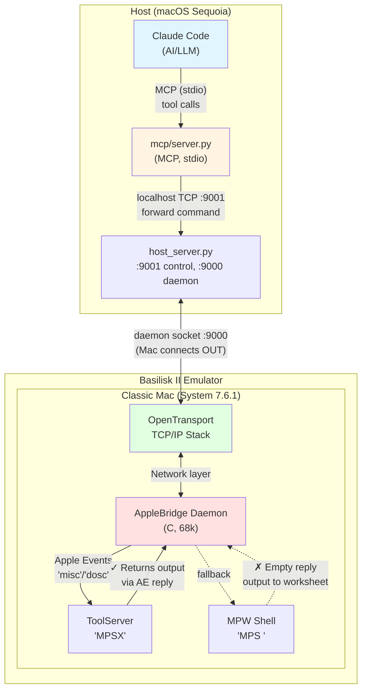
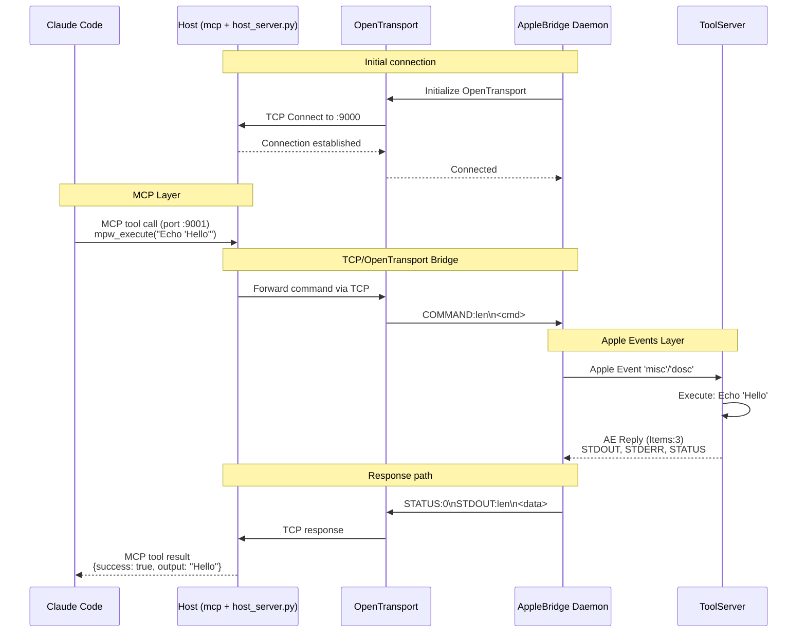
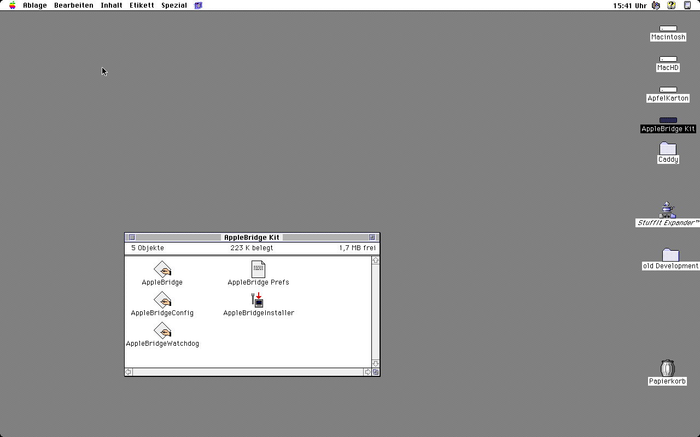
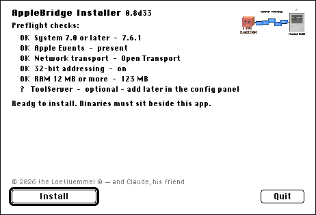
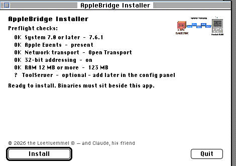
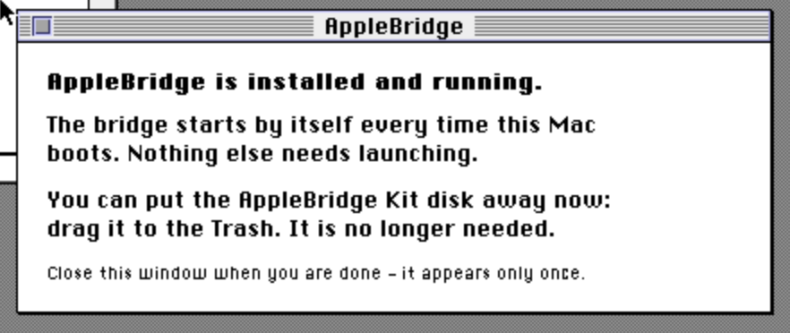
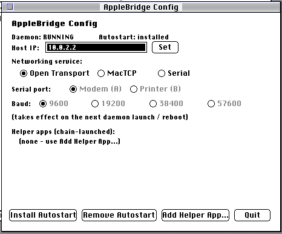

# AppleBridge

**AI-powered development for classic 68k Macintosh systems.**

AppleBridge connects Claude Code to an authentic Mac System 7.6.1 environment running in Basilisk II, enabling you to build, compile, and run classic Mac applications using natural language.



*Daemon 0.8d33 on System 7.6.1, with its optional **Verbose** console open: real commands
arriving over the bridge, and a footer carrying the transport, the RX/TX counters and the
error count. The daemon itself is **faceless** — it normally runs with no window at all, and
this console is toggled with `MONITOR:1`. The image was captured by the daemon, out of the
emulated framebuffer, streamed over the bridge and decoded to PNG on the host.*

## What You Can Do

```
You: "Create a counter app that counts from 0 to 20"
Claude: [Writes C code, compiles with SC, links, and runs on System 7.6.1]
Result: Classic Mac app running in authentic 1990s environment
```

**Examples:**
- **Build classic Mac apps** - Claude writes, compiles, and tests 68k code
- **Develop in assembly** - Create apps using MPW assembler with AI assistance
- **Automate MPW workflows** - Compile, link, and execute remotely
- **Debug with feedback** - Full command output capture via ToolServer
- **Learn retro programming** - AI tutor for 68k assembly and Toolbox APIs

## Architecture


```mermaid
flowchart TB
    subgraph Host["Host (macOS Sequoia)"]
        Claude["Claude Code\n(AI/LLM)"]
        MCPServer["mcp/server.py\n(MCP, stdio)"]
        HostSrv["host_server.py\n:9001 control, :9000 daemon"]
    end

    subgraph BAII["Basilisk II Emulator"]
        subgraph Mac["Classic Mac (System 7.6.1)"]
            AppleBridge["AppleBridge Daemon\n(C, 68k)"]
            OT["OpenTransport\nTCP/IP Stack"]
            ToolServer["ToolServer\n'MPSX'"]
            MPWShell["MPW Shell\n'MPS '"]
        end
    end

    Claude -->|"MCP (stdio)\ntool calls"| MCPServer
    MCPServer -->|"localhost TCP :9001\nforward command"| HostSrv
    HostSrv <-->|"daemon socket :9000\n(Mac connects OUT)"| OT
    OT <-->|"Network layer"| AppleBridge
    AppleBridge -->|"Apple Events\n'misc'/'dosc'"| ToolServer
    AppleBridge -.->|"fallback"| MPWShell
    ToolServer -->|"✓ Returns output\nvia AE reply"| AppleBridge
    MPWShell -.->|"✗ Empty reply\noutput to worksheet"| AppleBridge

    style Claude fill:#e1f5ff
    style MCPServer fill:#fff4e1
    style OT fill:#e1ffe1
    style AppleBridge fill:#ffe1e1
```

### Communication Flow


```mermaid
sequenceDiagram
    participant CC as Claude Code
    participant MH as Host (mcp + host_server.py)
    participant OT as OpenTransport
    participant AB as AppleBridge Daemon
    participant TS as ToolServer

    Note over AB,MH: Initial connection
    AB->>OT: Initialize OpenTransport
    OT->>MH: TCP Connect to :9000
    MH-->>OT: Connection established
    OT-->>AB: Connected

    Note over CC,MH: MCP Layer
    CC->>MH: MCP tool call (port :9001)<br/>mpw_execute("Echo 'Hello'")

    Note over MH,AB: TCP/OpenTransport Bridge
    MH->>OT: Forward command via TCP
    OT->>AB: COMMAND:len\n<cmd>

    Note over AB,TS: Apple Events Layer
    AB->>TS: Apple Event 'misc'/'dosc'
    TS->>TS: Execute: Echo 'Hello'
    TS-->>AB: AE Reply (Items:3)<br/>STDOUT, STDERR, STATUS

    Note over AB,MH: Response path
    AB->>OT: STATUS:0\nSTDOUT:len\n<data>
    OT->>MH: TCP response
    MH-->>CC: MCP tool result<br/>{success: true, output: "Hello"}
```

### Three-Layer Design

1. **MCP Layer** - Claude Code ↔ `mcp/server.py` ↔ `host_server.py` (control port 9001)
   - Standardized AI tool interface
   - Tools: `mpw_execute`, `mac_write_file`, `mac_screenshot`, etc.

2. **TCP/OpenTransport Layer** - Mac daemon ↔ `host_server.py` (port 9000)
   - Reversed architecture: Mac connects OUT to host
   - Solves Basilisk II NAT limitation
   - OpenTransport provides TCP/IP on System 7.6.1

3. **Apple Events Layer** - AppleBridge ↔ ToolServer/MPW Shell
   - Classic Mac IPC for command execution
   - ToolServer returns output, MPW Shell doesn't (use ToolServer!)

## Quick Start

### Prerequisites

**Host (macOS):**
- Basilisk II, with a guest that boots. Nothing else — the host side is Python
  stdlib, so the system `/usr/bin/python3` is enough and there is nothing to build.
- Claude Code, if you want the MCP tools. The bridge itself works without it.

**Guest (System 7):**
- System 7.5.3 or later with **Open Transport** (verified on 7.5.3, 7.6.1 and
  Mac OS 9), or MacTCP.
- **No compiler, and no MPW.** MPW + ToolServer are optional and add the
  *command tier* (`mpw_execute`, `mac_compile`, `mac_build`). Without them
  everything else still works: screenshots, fork-aware file transfer, input
  injection, directory listings, clipboard, launch and shutdown. An absent
  ToolServer is a tier you do not have, not a broken install.

**Three steps to a working bridge**, then one command to confirm it: **1–2** on the
host, **3** inside the emulator, **4** back on the host. The guest step cannot be
scripted, because System 7 offers no scripting surface for the TCP/IP control panel.

Claude Code is **not** part of that. The bridge is a host server and a guest daemon;
you drive it over the control port with anything that can open a socket. Step 5 wires
it to Claude Code for those who want the MCP tools, and it is the only optional step
here. Fully worked example with more screenshots: [docs/SETUP.md](docs/SETUP.md).

### 1. Configure the host

```bash
cd host && ./install_bridge.py --dry-run   # read the plan; it changes nothing
cd host && ./install_bridge.py
```

It discovers your emulator, sets its Ethernet backend to `slirp`, writes
`host/local.env`, installs the launchd agent that keeps the host server running,
and prints the guest-side values you need in step 3 — labelled by *whose*
address each one is, which is the mistake this step exists to prevent. It asks
for nothing and needs no password.

If it **refuses**, read what it says: it will not convert a host already
configured for the `etherhelper` backend, because that is somebody's working
AppleTalk setup. `--force-slirp` overrides it.

### 2. Get the guest kit

Download `AppleBridgeKit.dmg` from the [latest release](../../releases) — a 2 MB
disk image holding the four 68K applications, the journaling driver the daemon
opens by name, and a prefs file. Add it to the emulator as a second disk and
relaunch, because the disk list is read at launch only:

```
disk /path/to/AppleBridgeKit.dmg
```



**There is nothing to stamp on it.** The prefs ship `IP=10.0.2.2` — not the
address of the machine that built the kit, which a public artifact must never
carry, but the slirp constant that means *whichever host runs the emulator*:
slirp forwards it to that host's loopback, and the server hears it there because
it binds every address. So the kit needs no seeding step and no address of
yours.

The exception is a bridge server running on a **different** machine than the
emulator. Then the loopback is the wrong host, and only that machine's own
address can say so — set it in AppleBridgeConfig on the guest afterwards, or
write it into the image before you mount it:

```bash
cd host && ./install_bridge.py --seed-guest-prefs ~/Downloads/AppleBridgeKit.dmg
```

That second route needs `hfsutils` (`brew install hfsutils`), which macOS does
not ship; the config panel on the guest needs nothing.

### 3. In the guest: network first, then the installer

**TCP/IP control panel** — these are the *guest's own* values, and slirp answers
DHCP itself:

```
Connect via   Ethernet
Configure     Using DHCP Server
```

Do this **before** running the installer. Nothing breaks if you don't — the
daemon redials every 30 seconds and picks itself up — but an installer reporting
success over a bridge that never comes up reads like a failed install when only
one field is wrong.

Then open the **AppleBridge Kit** volume and run **AppleBridgeInstaller** from
it. It preflights the machine, refuses environments that cannot work, copies the
suite, and installs the autostart so the bridge comes up on every boot.



It says what it found before it does anything, and it names its own version so a
screenshot is answerable. A `?` is not a failure — `ToolServer` is optional, and
says so. If a **required** check fails, the Install button stays disabled rather
than letting you start something that cannot finish.

Press **Install**, and it reports where everything went and offers **Restart**:



When it is done, drag the kit volume to the Trash and remove its `disk` line.
On the first boot afterwards the daemon confirms it is running:



**If it does not go to plan, the installer wrote down why.** It leaves a text
file called `AppleBridge Install Log` at the root of the guest's boot volume —
the preflight table, the transports it found, one line per copied binary with
its error code, and whatever the window said. It is written when the installer
opens, before you press anything, so a run whose Install button is disabled by a
failed check leaves a record too. Attach that file to an issue and the answer is
usually in it. (The host installer does the same into
`~/Library/Logs/AppleBridge/`.)

#### The control panel

The daemon is **faceless** — it runs as a service with no window — so everything a
human needs to change about it lives in **AppleBridgeConfig**, installed alongside
it. Open it from the installation folder whenever you need to look:



| | |
|---|---|
| **Daemon / Autostart** | whether the service is running, and whether it starts at boot |
| **Host IP** | the one value a kit cannot know — **the host's** address, not the guest's, which is the confusion the label exists to end. `Set` writes it and the daemon picks it up |
| **Networking service** | Open Transport, MacTCP or Serial. `NET=` hot-swaps between commands, without relaunching the daemon |
| **Serial port / Baud** | dimmed unless Serial is selected. Read at startup, not hot-swapped, so they take effect on the next launch — and the host must be set to the same baud, as there is no autobaud |
| **Add Helper App…** | appends an `APP=` line; the daemon chain-launches these at startup, ToolServer first |
| **Install Autostart** / **Remove Autostart** | writes (or deletes) the Startup Items alias. It points at the *watchdog*, not the daemon, because the watchdog owns the daemon's lifecycle |
| **Quit** | quits the panel — not the daemon |

There are deliberately **no Launch/Stop buttons**. The daemon is meant to run
continuously, and quitting it tears down Open Transport in a way that has cost a
host crash. Start it through autostart, or from the Finder.

Full details, including how the autostart alias is built:
[mac/config/README.md](mac/config/README.md).

### 4. Check that it came up

```bash
cd host && printf 'MACSTATUS\n\n' | nc -w 5 localhost 9001
```

`host_connected=1` and `daemon_responding=1` mean the bridge is live. The daemon
also says so itself, in its own console in the guest: `SYNC-OK`, the host it
reached, and `HELLO:2` for the negotiated protocol.

If it does not come up, run `bridge_doctor` — it diagnoses across layers (launchd
job, listeners, emulator backend, the address the guest is configured to dial)
and answers even when the host server is down. Failure modes and their causes:
[TROUBLESHOOTING.md](TROUBLESHOOTING.md).

> **Building the guest software from source** is a different route and needs MPW
> on the guest — see [docs/SETUP.md](docs/SETUP.md) Part 3.1. The kit above
> exists so that nobody has to.

### 5. Optional: drive it from Claude Code

Everything above works without this. The bridge answers on the control port, so
any client that can open a socket can use it — that is how the verbs in this
README are shown, and it is how a machine with no Claude Code installed is
driven:

```bash
printf 'DISKINFO\n\n' | nc localhost 9001          # every mounted volume
printf 'LISTDIR:MeinMac:AppleBridge:\n\n' | nc localhost 9001
```

What MCP adds is the **30 tools** below, and natural language on top of them.
Edit `.mcp.json` in your project or `~/.claude/`:

```json
{
  "mcpServers": {
    "applebridge": {
      "type": "stdio",
      "command": "uv",
      "args": ["run", "python", "-m", "mcp.server"],
      "env": {}
    }
  }
}
```

That is the configuration committed in `.mcp.json`. The MCP server talks to
`host_server.py` on the same control port (9001); start the host stack with
`cd host && ./start_stack.sh` (it also auto-starts via launchd). Then:

```
You: "Execute 'Directory' command on the Mac"
Claude: [Uses mcp__applebridge__mpw_execute tool]
Result: MeinMac:MPW:AppleBridge:

You: "Create a Hello World app"
Claude: [Writes hello.c, compiles, links, launches]
Result: Mac dialog showing "Hello, World!"
```

## Available MCP Tools

**30 tools**, in two groups. The split matters more than the list: the *command*
tier needs MPW/ToolServer on the guest, everything else does not — so a guest
with no compiler is still fully driveable.

| Group | Tools |
|---|---|
| **Command tier** (needs ToolServer) | `mpw_execute`, `mac_compile`, `mac_build`, `mac_read_file`, `mac_list_files`, `mac_send_apple_event` |
| **Move bytes, run, observe** | `mac_put_file`, `mac_get_file`, `mac_write_file`, `launch_app`, `mac_screenshot`, `mac_clipboard_get`, `mac_clipboard_set` |
| **Drive the guest** | `mac_type`, `mac_key`, `mac_click`, `mac_menu`, `mac_menu_front`, `mac_host_click`, `mac_host_menu`, `mac_host_screenshot` |
| **Network discovery** | `mac_appletalk_browse` |
| **Lifecycle & liveness** | `mac_status`, `bridge_doctor`, `mac_verbose_log`, `mac_reboot`, `mac_shutdown`, `mac_restart_toolserver`, `mac_update_daemon`, `run_applescript` |

`mac_screenshot` reads the **emulated framebuffer** through the daemon, not the
host's window — so it is unaffected by where the emulator window sits or what
overlaps it. `mac_host_screenshot` is the host-side counterpart, for the moments
when a modal tracking loop has the guest and the daemon cannot answer.

## Project Structure

```
AppleBridge/
├── mac/                          # 68k Mac daemon (C)
│   ├── src/                      # Source files
│   └── Makefile.68k              # MPW makefile
├── mcp/                          # Python MCP server (the MCP entry point)
│   ├── server.py                 # `python -m mcp.server` (see .mcp.json)
│   ├── tools.py                  # the 30 MCP tools
│   └── mac_connection.py         # talks to host_server.py on :9001
├── host/                         # Host server + utilities
│   ├── host_server.py            # the bridge: :9000 daemon socket + :9001 control
│   ├── start_stack.sh            # bring up the stack (+ launchd auto-start)
│   ├── encoding_convert.py       # UTF-8 ↔ MacRoman
│   └── screenshot_decode.py      # Raw Mac pixmap → PNG (stdlib only)
├── examples/                     # Reference guest apps (MinAsm, MinQDC)
└── mac/examples/                 # Annotated single-file examples (C and 68K asm)
```

## Documentation

- **[ARCHITECTURE.md](ARCHITECTURE.md)** - Detailed explanation of the MCP + OpenTransport dual paradigm
- **[SETUP.md](docs/SETUP.md)** - Complete setup guide with networking, libraries, and encoding
- **[TROUBLESHOOTING.md](TROUBLESHOOTING.md)** - Common issues, fixes, and known limitations
- **[ASSEMBLY_TEMPLATE.md](ASSEMBLY_TEMPLATE.md)** - 68k assembly programming guide

## Key Features

✅ **Full automation** - AI writes, compiles, and runs code on authentic Mac
✅ **Bidirectional communication** - Complete command/response feedback loop
✅ **Encoding handled** - Automatic UTF-8 ↔ MacRoman + line ending conversion
✅ **Network transparency** - Works through Basilisk II NAT
✅ **Visual feedback** - RX/TX LED activity indicators
✅ **Production ready** - Stable on System 7.6.1 with OpenTransport

## Example Workflow

```bash
# Claude Code session:
"Create a counter app in MeinMac:MPW:OurTest that counts 0-20"

# Behind the scenes:
1. Claude writes counter.c
2. Converts to MacRoman via mac_write_file
3. Compiles: SC counter.c -o counter.o
4. Links: Link counter.o Interface.o MacRuntime.o -o Counter
5. Sets type: SetFile -t APPL Counter
6. Launches: Counter
7. Reports success with screenshot

# Total time: ~30 seconds
# Your effort: One sentence
```

## Status

**Current daemon:** 0.8d33 ("the journaling self-test tells the truth") — the version the daemon itself reports, from `mac/vers.r`
**Status:** Production Ready ✅

All core features working:
- ✅ TCP bridge, NAT-reversed (Mac connects OUT), with async OpenTransport connect
- ✅ Selectable networking backend — **Open Transport or MacTCP** — behind a transport seam, chosen from the Control Panel (`NET=OT|MacTCP`), auto-falling back to OT
- ✅ Application-level heartbeat + watchdog (no host-down freeze)
- ✅ Apple Events command execution (ToolServer returns output)
- ✅ Remote compilation and linking
- ✅ MCP integration with Claude Code (30 tools)
- ✅ Encoding conversion (UTF-8 ↔ MacRoman)
- ✅ Screenshot capture (emulated framebuffer → PNG, host-side decode)
- ✅ Host server auto-start via launchd

## Credits

**Built by:** Pit with love for 68K and Claude
**AI Assistant:** Claude Sonnet 4.5 (Anthropic)
**Technologies:** OpenTransport, MCP, Apple Events, MPW, System 7.6.1
**Platform:** Basilisk II emulator on macOS Sequoia

**"Connecting classic Mac to the future"** ✨

## License

[MIT](LICENSE) — © 2026 Pit Förster. The licence covers **this project's own
source code**.

**Read the warranty disclaimer, it is not boilerplate here.** This software
writes into emulator disk images, patches a system trap globally, and installs
an autostart item in the guest. It is provided as is, without warranty of any
kind.

**Apple components are not covered.** The 68K applications in
`AppleBridgeKit.dmg` are linked against Apple's MPW libraries (`MacTraps`,
`Interface.o` and relatives), which have never been released under terms that
explicitly permit redistribution. Nothing here grants you rights to those, and
an MIT header on this repository does not change their status.
