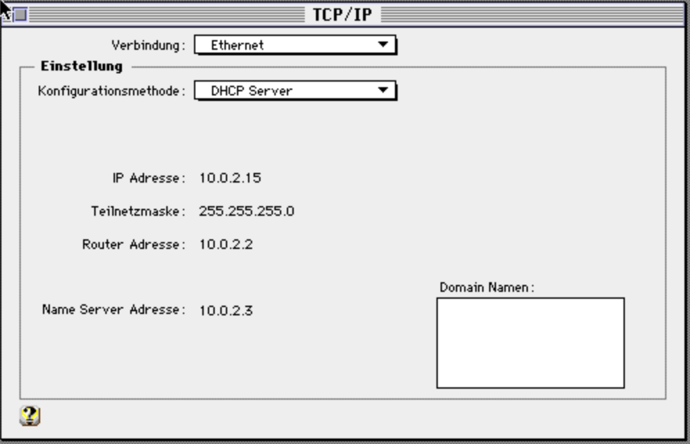
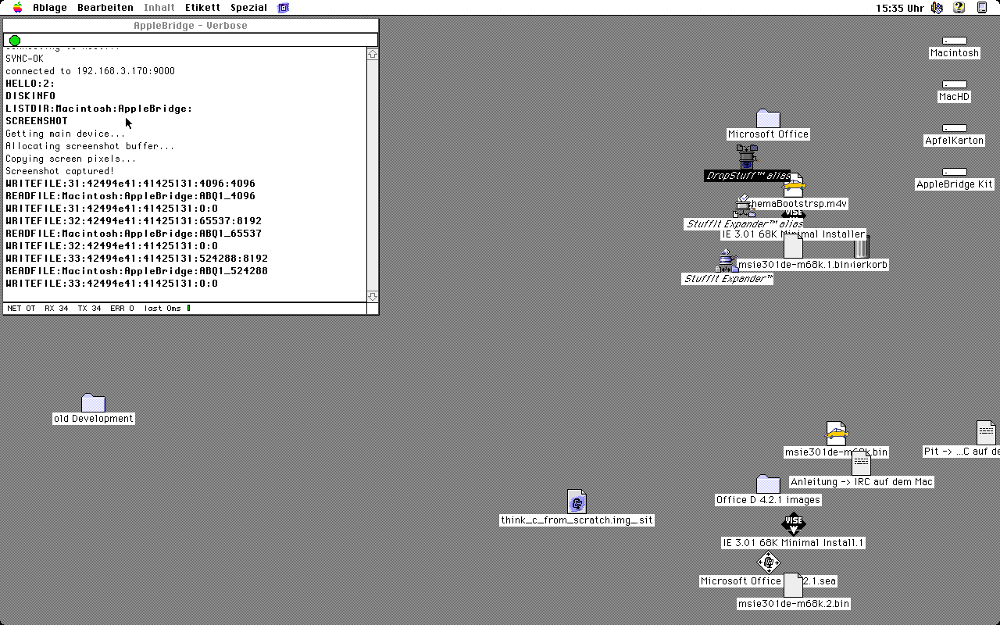

# AppleBridge — the detail behind the install

The install itself is in [the README](../README.md). This is the reasoning under
it, the source-build route, and the reference.

## Overview

AppleBridge connects Claude Code to a classic Mac System 7.6.1 environment via four layers:

1. **MCP layer** — Claude Code ↔ `mcp/server.py` (stdio), which exposes the 30 MCP tools.
2. **Control layer** — `mcp/server.py` ↔ `host_server.py` over `localhost:9001`.
3. **Bridge layer** — the Mac daemon ↔ `host_server.py` over `:9000`. The architecture is **NAT-reversed**: the emulator sits behind Basilisk II's MACNAT, so the **daemon dials OUT** to the host; the host never connects in.
4. **Apple Events layer** — the daemon ↔ ToolServer / MPW Shell.

The retired Swift `MacintoshBridgeHost` was replaced long ago by the stdlib-only Python `host_server.py`; if you find references to a Swift app or an Xcode build, they are stale.

## What this document is

**The installation path lives in [the README](../README.md)** — download the kit,
add a `disk` line, run the installer, check that it came up. Three steps and a
command, and it is the only path most people need.

This document is what sits *behind* that: why the emulator's networking is
configured the way it is and what the other backend costs, how to build the guest
software from source when you are changing the daemon itself, and the reference
material — MPW libraries, the wire protocol, character encoding. Prerequisites,
including which parts are optional, are in the README.

## Part 1: Basilisk II and the host network

### 1.1 Emulator networking (slirp, not MACNAT)

There are **two backends**, and which one you can have is decided by your machine, not by preference (D-018 in `DECISIONS.md`).

```bash
cd host && ./install_bridge.py --dry-run   # read the plan first; it changes nothing
cd host && ./install_bridge.py
```

**The installed branch is `slirp`.** It needs no interface alias, no bridge, no privileged step and no special emulator build, so it is the only one that comes up without somebody at the keyboard — and on a host with a single interface it is the only one that works at all, because a bridged backend cannot reach the machine it runs inside (D-015). The installer writes `ether slirp` into `~/.basilisk_ii_prefs`, generates `host/local.env` **without** a host address (the server binds `0.0.0.0`, since the guest's connection arrives from `127.0.0.1` or from your LAN address depending on which it dialled), and prints the guest-side values you then enter by hand:

| where | value | whose address |
|---|---|---|
| guest TCP/IP control panel | **`Configure: Using DHCP Server`** — slirp answers it and supplies all four | the **guest's own** |
| …if your build does not | `10.0.2.15` / `255.255.255.0`, router `10.0.2.2`, name server **`10.0.2.3`** | the **guest's own** |
| `AppleBridge Prefs`, `IP=` | this machine's LAN address | the **host's** |

Those two are the trap: the same word means opposite things three lines apart, and swapping them is silent.

**Prefer DHCP** (measured 2026-07-28: slirp handed out address, mask, router *and* name server `10.0.2.3`, and the daemon completed its v0.2 handshake on it; reproduced 2026-07-31 on a different host and a different guest — macOS 10.15, German System 7.5.3 — with the same four values). The reason is not the saved typing. Entered by hand, the name server is the field that gets left empty — and without it DNS fails as iCab `-23045`, which reads like a routing fault rather than a name one. DHCP cannot forget it.



**The cost of this branch, stated plainly: no AppleTalk.** No Chooser, no AFP mounts, no `mac_appletalk_browse`. TCP is unaffected, which is exactly how the gap disguises itself as something else.

**The `etherhelper` branch (MACNAT) keeps AppleTalk and is set up by hand.** The installer names it and stops rather than configuring it, and it **refuses to convert a host that already runs it** — pass `--force-slirp` if you really mean to. It needs a fork build of the emulator carrying `etherhelpertool` (from [kanjitalk755/macemu](https://github.com/kanjitalk755/macemu); a stock Basilisk II has none), two interfaces, and **two interactive password prompts per launch**, so it cannot start unattended:

```
ether etherhelper/en8
```

The guest then sits behind MACNAT: it can only connect **out**, its outbound traffic is NAT'd through the host's **default-route** interface (normally Wi-Fi `en0`), and it is **never pingable**.

**The rule that avoids a freeze, on that branch:** the host address alias must live on the **same interface the NAT exits** — the default-route interface. Aliased on a second NIC, the MACNAT return path splits across interfaces, the daemon's connect blocks, and the emulator freezes at 100 % CPU (it looks like a crash; it isn't). `host/start_stack.sh` sets that up. Background: <https://pit.390er.de/applebridge/anatomy-of-a-freeze-macnat-return-path/>.

> The 2026-06-28 benchmark measured slirp ~80 % down on bulk throughput and that argument held the default for a month — but it went through `Catenate`/`DumpFile`, i.e. ToolServer. The **native** `WRITEFILE`/`READFILE` path over slirp reached 291 KiB/s at 512 KB on slower hardware (2026-07-27), so a good part of that figure was the detour, not the transport.

### 1.2 Shared folder

Enable the Basilisk II Unix volume so files can move between host and guest:

```
Unix Root: <a folder of yours>       # e.g. ~/Desktop/Share
```

It appears as the `Unix:` volume on the Mac and is **read-only** from the Mac side, so source is copied to local storage before compiling.

### 1.3 Install MPW and ToolServer — the command tier, and OPTIONAL

Only needed if you want `mpw_execute`, `mac_compile` and `mac_build`, or if you
intend to build the guest software from source (Part 3). Everything else — file
transfer, screenshots, input injection, `LISTDIR`, `DISKINFO`, clipboard, launch
and shutdown — works on a guest that has neither, and the installer does not ask
for them. An absent ToolServer is a tier you do not have, not a failed install.

1. Copy the MPW folder to the Mac's hard drive (e.g. `MeinMac:MPW:`).
2. Verify MPW Shell launches (a worksheet window appears).
3. Launch **ToolServer** — it runs in the background with no window, and **must** be running for command output to come back over the bridge.
4. Verify the libraries are present: `Files "MeinMac:Interfaces&Libraries:Libraries:Libraries:"` should list `Interface.o`, `MacRuntime.o`, `OpenTransport.o`, etc.

With autostart installed (Part 3), the daemon **chain-launches ToolServer** itself on boot, so this becomes a one-time verification.

## Part 2: The host server

There is no host app to build — the host is Python.

### 2.1 Start the stack

```bash
cd host
./start_stack.sh
```

`start_stack.sh` (re)starts `host_server.py` and launches the emulator named by `APPLEBRIDGE_EMULATOR_APP` in `host/local.env`. On the **etherhelper** branch it first places the host address alias on the default-route interface — the freeze-avoidance rule above — through one admin prompt. On **slirp** there is no privileged step at all and it asks for nothing. The host server also **auto-starts via launchd** on login (`install_bridge.py` installs that agent), so on a configured machine the bridge comes up on its own.

> **macOS will announce a background item, and that is the agent working.**
> Right after `install_bridge.py` installs it, a notification says
> *"Background items added — `run_server.sh` is an item that can run in the
> background"* (German: *Hintergrundobjekte hinzugefügt*). That is the launchd
> agent, and it is the whole point: the host server has to be listening before
> the guest dials, so it starts at login rather than when somebody remembers to.
> It appears in **System Settings → General → Login Items & Extensions**, where
> it can also be switched off — and switching it off is what makes a
> previously-working bridge come up dead after a reboot, with nothing in the
> guest to explain it. Leave it enabled (seen 2026-08-01 on macOS 15).

> **Startup order does not matter.** If the daemon comes up first it simply finds
> nothing listening, logs the reason in its Verbose console, and connects on its
> next retry — at most ~40 s later (a 10 s bounded connect plus 30 s of backoff).
> Nothing needs restarting or rebooting.
>
> This used to be documented as a hard rule ("the daemon's early connects foul the
> socket"). No socket was ever fouled: a blocking `accept()` on `:9000` sat ahead of
> the control-port loop, so while no daemon was connected the server never serviced
> `:9001` and *every* tool hung — which looked like damage caused by the startup
> order. Fixed in PR #75; see the
> [root-cause write-up](https://pit.390er.de/applebridge/blocking-accept-disables-diagnostic-channel/).
> `mac_status` now answers whether or not the daemon is up, so it is the right first
> question when the bridge seems dead.

Server log: `/tmp/applebridge_server.log`. Smoke test once the daemon is connected:

```bash
cd host && /usr/bin/python3 send_command.py 'Echo HELLO'   # -> STATUS:0 ... HELLO
```

> **Registering the MCP server** is [README step 5](../README.md#5-optional-drive-it-from-claude-code),
> and it is optional: the bridge answers on the control port, so anything that can
> open a socket drives it.

Once the link is up, the daemon's own console is the confirmation — `SYNC-OK`,
the host it reached, and `HELLO:2` for the negotiated protocol:



## Part 3: Get the guest software onto the Mac

Installing the ready-made kit is [README steps 2-3](../README.md#2-get-the-guest-kit).
What follows is the other route: building the guest software yourself.

### 3.1 Build from source (needs MPW on the guest)

Use this when you are changing the daemon itself. Everything below is the
developer path; the 68K specifics — which Makefile, why not PowerPC, what a
minimal build looks like — are in [mac/BUILD_NOTES.md](../mac/BUILD_NOTES.md).

### 3.1.1 Transfer the source

Convert the daemon source from host UTF-8/LF to Mac MacRoman/CR and copy it over:

```bash
cd host
uv run python encoding_convert.py to-mac ../mac/src/     /Users/pitforster/Desktop/Share/src/
uv run python encoding_convert.py to-mac ../mac/include/ /Users/pitforster/Desktop/Share/include/
```

On the Mac, copy from the read-only `Unix:` volume to local storage (the `mac_put_file` MCP tool can also stream files directly, type `TEXT` / creator `'MPS '`):

```
Duplicate -y Unix:src:     MeinMac:MPW:AppleBridge:src:
Duplicate -y Unix:include: MeinMac:MPW:AppleBridge:include:
```

### 3.2 Host IP

The host IP is read from the **`AppleBridge Prefs`** file (`IP=<your host's LAN address>`), editable in-place, via the **AppleBridgeConfig** control app, or by seeding a powered-off disk image with `host/install_bridge.py --seed-guest-prefs <image.dmg>` — no source edit needed.

There is **no compiled-in fallback address** and deliberately so: a shipped default is right on one machine and, on a LAN where that address answers, makes the daemon connect to the **wrong computer** and report full health — protocol negotiated, heartbeat running, no errors on either console. With no address the daemon refuses to dial and says why. Never seed a guessed one (R1, R2 in `docs/INSTALLER_REQUIREMENTS.md`).

### 3.3 Build

In MPW / ToolServer, with the library path set:

```
Set LIBS "MeinMac:Interfaces&Libraries:Libraries:"
Directory MeinMac:MPW:AppleBridge:
Make -f Makefile.68k > BuildIt; BuildIt
```

`Make` only *prints* the build commands, so write them to `BuildIt` and execute it. The Makefile compiles each source (`main.c`, the `transport.c` / `transport_ot.c` / `transport_mactcp.c` seam that replaced the old `network.c`, `protocol.c`, `command.c`, `fileio.c`, `events.c`, `auth.c`, …), links with `ILink -model far` (plain `Link` now fails this binary with Error 48 — one ~98 KB segment against a 32 KB PC-relative reach; D-011), merges the `SIZE` resource with `Rez AppleBridge_res.r` (required for Apple Events — without it every command fails with `-903`), and sets the type/creator (`APPL` / `'ABrg'`). Result: `:bin:AppleBridge`.

> Build off the running daemon: link to `:bin:AppleBridge.new` and swap it in, rather than overwriting a running binary.

### 3.4 Deploy and autostart

Run the **AppleBridge Installer** to fork-aware-copy the binary to its deployed home (`HOME=` in prefs, e.g. `MeinMac:AppleBridge:`) and install autostart. On a cold boot the **watchdog** (in Startup Items) then launches the daemon, which chain-launches ToolServer — the whole bridge comes up invisibly. See `mac/config/README.md`.

## Reference

### MPW libraries

The daemon links against:

| Library | Purpose |
|---------|---------|
| `OpenTransport.o` | TCP/IP networking (OT backend) |
| `OpenTransportApp.o` | OT application support |
| `OpenTptInet.o` | Internet protocols |
| `Interface.o` | Toolbox trap definitions (also resolves MacTCP driver calls) |
| `MacRuntime.o` | C runtime initialization |
| `StdCLib.o` | Standard C library (from `CLibraries:`) |

Folder layout: `MeinMac:Interfaces&Libraries:Libraries:` contains `Libraries:` (`Interface.o`, `MacRuntime.o`, `OpenTransport*.o`, …) and `CLibraries:` (`StdCLib.o`, …). Reference them as `"{LIBS}Libraries:Interface.o"` and `"{LIBS}CLibraries:StdCLib.o"` with `Set LIBS "MeinMac:Interfaces&Libraries:Libraries:"`.

### Wire protocol (v0.1 core)

**Request (host → daemon)** — length-framed:

```
COMMAND:<length>\n<command_text>
```

**Response (daemon → host)** — read by declared length; CR-terminated fields:

```
STATUS:<code>\rSTDOUT:<len>\r<stdout>\rSTDERR:<len>\r<stderr>\r\r
```

The frame formats above are specified in full in
[protocol/PROTOCOL.md](../protocol/PROTOCOL.md) (version 0.1.0).

Since v0.2 the session opens with a `HELLO:` version-negotiation handshake (and optional token authentication); a v0.1 peer that doesn't understand it falls back to legacy cleanly. Full detail in [PROTOCOL_v0.2.md](PROTOCOL_v0.2.md).

**Screenshot** — request `SCREENSHOT`; the daemon streams the raw main-GDevice pixmap, which the host decodes to PNG:

```
IMAGE:<width>:<height>:<depth>:<rowBytes>:<clutCount>:<dataSize>\n<CLUT><pixels>
```

### Character encoding

Files crossing between host and Mac are converted by `host/encoding_convert.py` (UTF-8↔MacRoman, LF↔CR):

| Character | UTF-8 | MacRoman | Usage |
|-----------|-------|----------|-------|
| ∂ (partial) | E2 88 82 | B6 | MPW line continuation |
| ƒ (florin) | C6 92 | C4 | MPW dependency marker / folder |
| ≈ (approx) | E2 89 88 | C5 | MPW wildcard |
| … (ellipsis) | E2 80 A6 | C9 | Option-; |

Line endings: Mac Classic uses CR (`\r`), Unix/macOS uses LF (`\n`).

### MPW Makefile syntax

- **Dependency marker:** `ƒ` (Option-F), not `::`.
- **Line continuation:** `∂` (Option-D).
- **Variables:** `Set LIBS "…"`, referenced as `"{LIBS}Libraries:Interface.o"`.
- Use **TAB** for command indentation, not spaces.
- `Make` prints commands; run them with `Make -f Makefile.68k > BuildIt; BuildIt`.

## Advanced

### Standalone / interactive host server

For debugging without MCP, run the server from a TTY (system Python):

```bash
cd host && /usr/bin/python3 host_server.py
Command> Directory
```

### Screenshot over the control port

```bash
printf 'screenshot\n\n' | nc localhost 9001   # returns a base64-PNG frame
```

`host/screenshot_decode.py` (pure stdlib) decodes the raw pixmap to PNG.

### Serial transport (experimental — reaches Ethernet-less Macs)

For a Mac with no Ethernet (Plus, SE, Classic), the daemon can run over a serial
line instead of TCP. Set `NET=Serial` (optionally `PORT=A|B`, `BAUD=`) in the
daemon prefs, and start the host server in serial mode:

```bash
APPLEBRIDGE_SERIAL=/dev/tty.usbserial-XXXX APPLEBRIDGE_BAUD=57600 /usr/bin/python3 host/host_server.py
```

To test it with **no hardware**, `host/serial_harness.py` creates a lossless pty
bridge: point Basilisk's `seriala` at one path it prints and
`APPLEBRIDGE_SERIAL` at the other. Full design, framing, and the reliability
caveats for real hardware are in [SERIAL_TRANSPORT.md](SERIAL_TRANSPORT.md).

## See also

- [README.md](../README.md) — intro and examples
- [ARCHITECTURE.md](../ARCHITECTURE.md) — full design
- [PROTOCOL_v0.2.md](PROTOCOL_v0.2.md) — the wire protocol and its v0.2 revision
- [TROUBLESHOOTING.md](../TROUBLESHOOTING.md) — failure modes and fixes
- [ASSEMBLY_TEMPLATE.md](../ASSEMBLY_TEMPLATE.md) — 68k assembly guide
- [PREFS_PATH_DISCOVERY.md](PREFS_PATH_DISCOVERY.md) — open proposal: find the prefs file the emulator actually reads
- Build recipes, trap defs, encoding tables — the user's global `~/.claude/CLAUDE.md`

---

**Last Updated:** August 1, 2026
**Target:** AppleBridge 0.8d33 (protocol v0.2), Python host via launchd, 30 MCP tools
