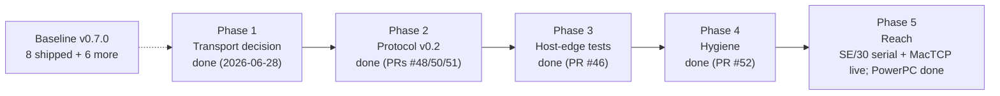

# Ledger archive — completed-item narratives, as of 2026-07-28

This is a **verbatim snapshot** of the [AppleBridge roadmap
ledger](https://pit.390er.de/applebridge/applebridge-roadmap-ledger-progress-and-status-tracker/)
taken before its first subtraction pass, at 108,964 characters.

## Why it exists

The ledger's job is **status**: what shipped, what is open, what is blocked.
Its done entries had instead grown into dated accounts of engineering work —
70 completed items totalling 64% of the page, median 715 characters against a
status line's ~150, the largest 13,076. D-006 assigns dated accounts to the
article corpus, not to the tracker, so this was a class of fact the ledger did
not own and kept absorbing because writing the narrative where you are already
editing is the path of least resistance.

The compression that followed reduced each completed entry to one line. This
file is what makes that reversible.

## Why a file in the repository rather than "it's in git anyway"

It was not. The ledger lives on a CMS whose content directory has **no version
history**, so before this snapshot the page's own past existed nowhere — the
repository held the code and the pull-request bodies, which is a different
thing. Committing it here is what makes the claim true.

Durable *gotchas* from these narratives were harvested into their proper owners
before compression — `CLAUDE.md` for mechanisms and traps, `DECISIONS.md` for
decisions of record, the memory files for cross-session facts. Anything below
that is not in one of those is history, not guidance: read it for what happened,
not for what to do.

---

This is the living checklist companion to [*AppleBridge at v0.7.0: A Roadmap Analysis and the Improvement Space Ahead*](/applebridge/applebridge-at-v0-7-0-a-roadmap-analysis-and-the-improvement-space-ahead/). That article is the reasoning — why each item matters and in what order; this one is the tracker. The boxes below reflect current status and are ticked by editing this page as work lands. Items are grouped by layer, exactly as in the analysis.

## How to read this ledger

Each line is a task-list item you can scan at a glance:

- `[x]` — done (shipped and verified).
- `[ ]` — not yet complete. The status word after the em-dash says whether it is *Open* (untouched), *In progress* (started/partially done), *Blocked* (waiting on something named), or *Deferred* (consciously descoped).
- `P1`–`P3` — priority: **P1** reliability/unblocking, **P2** capability, **P3** polish.

A checkbox has only two states, so partial work is shown as an unchecked box plus an explicit *In progress* status and a note.

## Baseline — shipped in v0.7.0

The work already delivered, for reference. These anchor the ledger's "done" column.

- [x] **Selectable MacTCP transport + transport seam** — *Done v0.7.0* · OT/MacTCP behind a common abstraction with a fallback ladder.
- [x] **Preflight installer** — *Done v0.7.0* · Gestalt capability probes before copy; relocatable via `HOME=`.
- [x] **Native `LISTDIR` directory listing** — *Done v0.7.0* · `PBGetCatInfo`, no ToolServer.
- [x] **Fork-aware binary transfer** — *Done* · `mac_put_file`/`mac_get_file` in MacBinary framing.
- [x] **Synthetic input injection** — *Done* · `mac_type`/`mac_key`/`mac_click`; hardened **lossless under load** (PR #55 — retry `PostEvent` on a full OS event queue).
- [x] **Verbose on-screen console** — *Done* · full output, bold commands, working scrollbar.
- [x] **20-tool MCP surface** — *Done* · Surfaces A/B, liveness, one-shot build, screenshot-as-image.
- [x] **Faceless-service arc** — *Done* · daemon + config app + watchdog + autostart; heartbeat and async connect.

## Committed roadmap

The four items explicitly on the books.

- [x] **slirp transport — go/no-go decision** — *Done 2026-06-28* · P1 · Benchmarked live against the `etherhelper/en8` baseline (`host/bench_transport.py`, results committed). Legacy slirp gives **−27 % latency** (faster, sd 49→14 ms) but **−80 % bulk throughput** and **+213 % screenshot time** — a trade-off, not a win. **Decision: no-go as default; stay on `etherhelper/en8`; revisit only with a `libslirp`-based build.**
- [x] **P3 security: handshake + bounded reads** — *Done (v0.2, PRs #48, #50, #51)* · P1 · opt-in shared-secret mutual authentication (FNV-1a-64; token in guest prefs + host env var) plus oversized-declared-length rejects. Fail-closed; verified on-device.
- [x] **P4: automated tests** — *Done (PR #60)* · P1 · host-edge suite (PR #46) + the v0.2 protocol/auth transcript tests (PRs #48, #50, #51) + serial pty tests (PR #53), and now the live **e2e-smoke tier** (PR #60), have all landed. **Extended 2026-07-28 (PR #116) with a coverage ratchet**, because having tests turned out not to be the same as having them anywhere useful: four defects in two days (see the two entries under *Guest side* below) were all **deciders** — take data, return a verdict, no network, no disk, three lines to test — and all four had *no test at all*, which is why each survived every build that used it. A wrong verdict looks exactly like a right one from outside. `tests/test_decider_coverage.py` now walks `host/*.py` and fails the suite on a decider that no test reaches and that is not explicitly excused with a reason. Two calls decide whether such a thing is useful or noise: **an injected callable does not disqualify a function** (rejecting them would exempt `bridge_doctor`'s probes — including `probe_sockets`, one of the four — from the ratchet built for them), and **coverage is transitive** (`test_bridge_doctor` drives every probe through `collect()` and names none; name-grep alone claimed 36 untested, reachability says **9**, and a ratchet that cries wolf gets a blanket exemption inside a month). The debt list may shrink only: a high-water assertion stops it growing and a staleness check evicts an entry once it *is* covered. Four guards protect the ratchet from itself — the classifier must still recognise the three functions that actually broke, must still reject an I/O driver, the scan must have found functions at all, and the file is **excluded from its own test corpus**, since its debt list spells the untested names out and would otherwise satisfy the check by reading itself. All mutation-verified. **First use of it, same day (PR #117), paid for itself twice over.** Writing the missing test for the one entry on the list flagged as genuine debt — `build.py::get_file_list` — found a live defect immediately: it split an MPW `Files` listing on **whitespace**, and `Files` prints one name per *line* and quotes any name that needs one, so `'AppleBridge old'` came back as `'AppleBridge` and `old'` — the real file gone, two entries naming nothing in its place, and everything downstream compiling or deleting against a wrong list with no status code to say so. The guest is full of such names (`System Folder`, `Apple Menu Items`). The sharpest part: **`mac_list_files` already parses by column precisely because of this problem** — the knowledge was in the codebase and this function never got it, which is the concrete cost of an untested decider. The outbound direction had the same hole (`Files MeinMac:My Folder:` is two arguments to the shell). And using the ratchet exposed **two flaws in the ratchet**: `HIGH_WATER = len(BASELINE)` made its own bound true for every possible list — a check that examines nothing, in the file whose subject is checks that examine nothing — and the self-exclusion canary, keyed on a real debt-list name, fired the moment that function was genuinely tested, reporting "the ratchet is vacuous" about a *repair*. A canary that fires on good news is one somebody eventually deletes; it is now a marker string that exists nowhere else. Debt list **9 → 8**, with no genuine debt left on it. Suite now **402 checks**.
- [x] **Control Panel (cdev) polish** — *Done 2026-07-04* · P3 · the helper list became a real self-drawn `userItem` (multi-row, click-to-select) and a **Remove** button deletes the selected `APP=` line from the prefs — both **verified live over the bridge** (the list drew ToolServer on its own framed row; a synthetic click hilited it; **Remove** rewrote the prefs cleanly — the `APP=` line gone, every other line intact, truncated with `SetEOF` — and the list redrew `(none)`). Two code-resource lessons earned: the **List Manager is glue** in this MPW (no `ONEWORDINLINE` in `Lists.h`), so the list is drawn with the inline-QuickDraw bank only and clicks are hit-tested geometrically (`PtInRect`); and integer **divide/modulo pull the `LDIVT`/`LMODT` runtime helpers** (unreachable in a code resource — same class as `NumToString`), so the row math uses addition-only loops. The functional port of `AppleBridgeConfig` to a Control Panel is done; the only deliberate omission is a scrollbar (5 rows shown, real helper counts are 1–3). See `mac/controlpanel/README.md`.

## Improvement space by layer

### Wire protocol (v0.1 → v0.2)

- [x] **Version negotiation (`HELLO:` handshake)** — *Done (v0.2, PR #48 host / #51 daemon)* · P1 · the host probes with `HELLO`; a v0.1 daemon answers "Invalid command format" and falls back to legacy, so a new host serves an old daemon and vice-versa. Verified live.
- [x] **Shared-secret handshake + bounded reads** — *Done (v0.2, PRs #48, #50, #51)* · P1 · mutual challenge/response (fail-closed); FNV-1a-64 computed identically on the 68K daemon (32-bit halves) and the host; `MAX_DECLARED` / `MAX_CTRL_REQUEST` bounds. `negotiated protocol v2 + auth OK` confirmed on-device.
- [ ] **Persistent connections** — *Deferred* · P2 · consciously descoped from v0.2: the guest link is already persistent, the `:9001` server already serialises clients, and the MCP client opens a socket per command — so there is no benefit without a coordinated client change, and a persistent session would add head-of-line blocking. Revisit only on measured need.
- [ ] **Compression** — *Open* · P2 · *raised from P3 on 2026-07-27.* The original reasoning measured the ToolServer detour rather than the transport, so "a transport-side win is ruled out" no longer stands on its own. The live case is the **screenshot**: the bridge carries the **raw** PixMap (768 KB at 1024×768×8) while the resulting PNG is ~17 KB, and one capture takes ~15 s on the slirp tier — the single operation a GUI-driving loop repeats constantly. PackBits already exists in `host/tools/gif_to_rez.py`, applied in the other direction. For a single-interface host this is less an optimisation than a precondition.
- [ ] **Async responses for long commands** — *Open* · P3 · wants persistent connections first; artifact-verify workaround is serviceable meanwhile.

### Guest side (daemon and ecosystem)

- [x] **Transport hot-swap (no relaunch on `NET=` change)** — *Done (PR #66; daemon 0.8d9–d10)* · P2 · the daemon re-reads `NET=` at the top of its main loop (throttled ~5 s) and, on a change, tears down the active OT/MacTCP/Serial stack and brings up the new one **live** — dropping the link so the reconnect loop re-dials on the new backend, no relaunch. A Control-Panel radio flip switches stacks in ~4 s, verified both directions on Basilisk II (a shared `ABTransportName()` also relabels the monitor footer and fixes STAT's `net=`).
- [x] **Serial transport backend** — *Done 2026-07-06 (live round-trip on a real SE/30)* · P2 · the only path onto Ethernet-less compact Macs (Plus/SE/Classic). Backend merged (#53): a Serial Manager backend (`transport_serial.c`) behind the seam, host serial mode (`SerialConn`) + a no-hardware pty harness, `NET=Serial`/`PORT=`/`BAUD=` prefs — guest **build-verified on-device** (the added code tipped the daemon past the near-model 32 KB limit; fixed by compiling `-model far`), host unit-tested (82/82). A **drag-install package for real Ethernet-less 68k hardware** also shipped (#54): serial-aware installer preflight/default + a `vers`-stamped universal AppleShare package (`docs/DEPLOY_SERIAL_HARDWARE.md`). The **Control-Panel serial config** landed too (#74): a Serial transport radio plus Modem/Printer-port and 9600/19200/38400/57600 baud selectors (dimmed unless Serial), with the default line rate lowered to **9600 on both ends** (no autobaud). **Live round-trip done 2026-07-06** on a real **Macintosh SE/30** (System 7.5): RS-422 @ 57600, `negotiated protocol v2`, native `STAT`/`LISTDIR`/screenshot — no ToolServer, no network. Hardware lessons: **AppleTalk must be Inactive** (it shares the Z8530 SCC → an Error 11 spurious-interrupt on serial open otherwise), and `BAUD=` did not propagate from the CP so the daemon ran at its compiled default. **Reliability is the one remaining sub-item** — see *Real-hardware fixes & findings (SE/30, 2026-07-06)* below. Design in `docs/SERIAL_TRANSPORT.md`.
- [x] **Mouse / modal-menu driving (journaling driver, or host-side mouse tool)** — *Done (scoped) 2026-07-05 (PRs #69, #70; daemon 0.8d23)* · P2 · Route (a), the guest-side **journaling `DRVR`**, is **built and shipped** — a classic 68k playback driver (`mac/journal/ABJournal.a`) whose `Control` routine answers the Event Manager's journal opcodes (`jGetMouse`/`jButton`/`jEvent`) so `MenuSelect`/`PopUpMenuSelect`/`ModalDialog` read *injected* events even inside their tight hardware-polling loops. Delivered in verified steps: a step-3 ROM gate (journaling *is* consulted on this ROM), faceless-daemon install (`JGATE`), pop-up + real menu-bar driving (`JMENU`/`JABOUT`), an **interrupt-time freeze watchdog** (`JSAFE` — a Time Manager task zeroes `JournalFlag` at interrupt time, recovering a modal that spins at 100 % without polling the journal), **modal Standard File button-driving** (`JSF` — `SFGetFile` + a dlgHook resolving each button's live global rect; the daemon foregrounds itself with a *pump-until-front* handshake so its own modal receives events), and **menu-selection *by name*** on the bridge's own menu bar (`MENU:<title>:<item>`, plus a `mac_menu(title, item)` MCP mode). This resolves the long-standing "menu-select by name for shortcut-less items" deferral from *Input-injection completeness*. **Scope / boundary (important):** journaling drives only the **bridge's own** menus and modal dialogs. A background daemon's `MenuSelect` uses its own per-process `MenuList`, and a feasibility spike (`JPROBE`) confirmed that arming journal playback + a background `WaitNextEvent` never pumps the journal at all — so **driving a *foreign* front app's modal loop (the original OS-9 Sherlock scope pop-up) is infeasible via journaling**. For a foreign app on a *local* Basilisk, route (b) — the host-side mouse tool (`cliclick`, with a guest→host calibration; SDL delivers it as genuine hardware input) — remains the answer; on the *remote* SheepShaver there is no journaling route to a foreign app's modal loop. The tracked deliverable (the journaling driver + shortcut-less menu-by-name for the bridge's own UI) is therefore complete, and the cross-process limit is now a documented boundary rather than open work. Design + full progress: `docs/JOURNALING_MENU_BY_NAME.md`.
- [x] **Monitor telemetry (error counter, last command, latency)** — *Done 2026-07-04 (0.8d6)* · P3 · the Verbose console's footer strip + `STAT` now report **RX/TX/ERR** counters, the last **real** command's round-trip latency (a number *and* a colour-coded analog **health bar**), and an **err:`<tag>`** identifier for the most recent error; `mac_status` surfaces `err_count`/`last_latency_ms`/`last_error`. `ERR` counts bridge/verb-level errors (`STATUS != 0`) — a guest command that fails is a successful round-trip, not an error. Latency is heartbeat-gated (real commands only, so ~0-tick PING/STAT don't clobber it) — two clobbering bugs were caught in live verification. Built, `SWAPSELF`-deployed, and verified on-device (System 7).
- [ ] **Output capture for AE-bypassing tools (`Make`)** — *Open* · P3 · daemon-side redirect-to-temp-file convention.
- [x] **A second toolchain: the ToolServer-less tier can build** — *Done 2026-07-27 (PRs #106–#108)* · P2 · the clean-room question was what AppleBridge can do on a guest with **no MPW and no ToolServer**, and the answer turned out to be more than remote control. **THINK C's Project Manager carries an `aete`** — `KAHL/MAKE`, `CMPL`, `LINK`, `SNTX`, `RUN`, and `NOUI`/`UI` — so the machine has a scriptable compiler. Verified end to end: a source pushed over the bridge was compiled by THINK C and the running program displayed the new string; `KAHL/RUN` started it from the host. **Honest limit:** `KAHL/MAKE` was accepted (`status=0`) and touched the project but did not recompile a source changed from outside — the keyboard command did. The source path is proven over the bridge, the build *trigger* is not. New tooling: `host/tools/guest_explore.py` (walk directories, read both forks, inventory resource types, parse an application's Apple Event vocabulary), and the `:9001` control port may now be opened to the network — but only with a token, enforced by refusing to start otherwise, so one agent session can drive bridges on several machines.
- [x] **Crash fix: `LAUNCH` refuses non-applications** — *Done 2026-07-27 (PR #108)* · P1 · a verb reachable from the host could take the whole guest down. `LAUNCH` set `launchNoFileFlags` — telling the Launch Manager explicitly *not* to check the file's flags — and then launched whatever path arrived; a `LAUNCH` of a THINK C project file (`'PROJ'`) crashed the emulator and left the disk unflushed. Having disabled the system's check, the daemon now makes its own and refuses anything that is not `'APPL'`. Needs an on-device build to take effect. Four operational findings came with it (R17–R20): an acknowledged write is not a durable write (the read that confirms it reads the same disk cache); an open application outranks the file on disk (the IDE builds from its editor buffer); suppressing the interface suppresses the errors (`NOUI` hid a compile failure — judge a headless build by its artifact, never by the absence of complaints); and classic sources must move as bytes, since a host-side text-mode round trip rewrites every `CR` to `LF`.
- [x] **`AESEND` must not be able to starve the guest** — *Done 2026-07-28 (PR #114, daemon 0.8d32)* · P1 · the same requirement as the `LAUNCH` fix above, reached by a second verb (R16). Driving THINK C on 2026-07-27, a bare `KAHL/RUN` reached an application that needed to interact, could not, and never replied. The daemon was inside `AESend` with `kAEWaitReply` and `AE_SCRIPT_TIMEOUT` — **five minutes** — and on a cooperative scheduler a non-yielding application starves everything behind it: the guest stopped switching windows, the host logged `command timeout after 240s`, and the emulator had to be force-quit with the disk image open. The timeout was not careless — ~5 min exists because `kAEDefaultTimeout` returned spurious `-1712` on long `Link`/`SC` builds. The defect was that a value reasoned about for **ToolServer**, an application we own and which always answers, was inherited by a verb that can address **any** application. Both guards now ship, carried by one optional wire field (`AESEND:<t>:<c>:<i>:<doLen>[:<waitTicks>]`, additive so an older daemon parses the request unchanged): `0` ticks sends `kAENoReply` and cannot block at all — the honest choice for the many events whose `aete` declares reply `'null'`, exposed as `mac_send_apple_event(expect_reply=False)` — while an omitted field now means **30 s**, the interactive default, clamped at 180 s. `'dosc'` keeps its five minutes; long builds still need them. Measured live against a target that provably cannot answer (the daemon itself): no bound **30.0 s**, `:300` **5.0 s**, `:0` **0.2 s**, with the bridge answering a `STAT` within 50 ms after each. **The requirement's own earlier wording was wrong** and is corrected in `docs/INSTALLER_REQUIREMENTS.md`: it said the *host's* timeout should be the shorter of the two, but a host that gives up first merely reports a timeout about a guest that is still starving. The **daemon** gives up first, its ceiling sitting below the host's read timeout, and the host derives its read budget from the bound it sent. Related and already answered: `MAKE` returns `0` and builds nothing because its direct parameter is a **required `'obj '` object specifier** naming the project, which the text-only `AESEND` cannot construct.
- [x] **A failure says which verb and which code** — *Done 2026-07-28 (PR #114, daemon 0.8d32)* · P2 · found by reading `ERR 2` off the monitor after the two timeouts above and being unable to learn anything from it. Three verbs shared the literal tag `"cmd fail"` — the least useful thing an error counter can remember, since the counter already said a command had failed. `NoteErrCode` now records the verb and the `OSErr` (`lasterr=AESEND -1712`). The host had the same hole from the other side: it logged the **request** and discarded the response, so a failure and a success left an identical trace; it now logs a non-zero `STATUS` with the daemon's own text. One trap worth keeping: a response frame does **not** use one line ending — classic-Mac C maps `'\n'` to CR and `'\r'` to LF, so `STATUS`/`STDOUT` end in CR and `STDERR`'s length in LF, and the first parser split on CR alone, found the code and dropped the sentence explaining it.
- [x] **Two host-side checks that reported without looking** — *Done 2026-07-28 (PR #115)* · P1 · both found by asking whether the morning's communication errors were really gone, and neither was a communication error. **(1)** `timeout_for` chose a command's budget from its **first token**, but the bridge is driven with compound lines: `Directory "…"; Rez …; SetFile …` is one build step, so a `Rez` that needs 240 s was classified as `Directory` and given 15. The host stopped listening while the reply was still arriving, the leftover bytes were swept up by the next command's anti-desync drain, and the caller was told `Mac daemon not connected` about work that had **completed** on the guest. That is the expensive direction of the error: the obvious response is to run it again, and two `Rez -a` runs append the resources twice. Now every `;` / CR / LF / `&&` / `||` segment is examined and the longest budget wins, first token per segment only so `Echo "rez"` stays short. **(2)** `bridge_doctor` printed *"no guest is connected to :9000 yet"* on a freshly booted guest while `lsof` showed the link ESTABLISHED — its peer probe was anchored on the **configured** host address, and the slirp branch has none by design (D-018), so the pattern matched nothing across the whole branch the installer sets up. Anchored on the port instead, which is also more correct on the etherhelper branch. Both functions had **no tests**, which is why a one-line classifier and a one-line regex stayed wrong; 14 new checks, verified to fail against the old code. Live-confirmed on a clean boot: the identical failing line returned its reply, and a full pass — 377 offline checks, `smoke_e2e --full` 6/6, `q1_native_surface` 11/11 — finished with `err=0` and an empty `lasterr`.
- [x] **AppleTalk/NBP lookup verb (`NBPLOOK`)** — *Done 2026-07-25 (PR #81, daemon 0.8d25)* · P2 · answering "which file servers can the guest see?" used to mean opening the Chooser by hand, and that path is doubly closed to a bridge: the Chooser's server list is built by a modal tracking loop polling the *hardware* mouse (synthetic clicks never land in it), and the faceless daemon cannot open the Chooser at all, because its own Apple menu does not route desk-accessory items to `OpenDeskAcc`. Driving it host-side with `cliclick` cost a stray click outside the emulator and a daemon starved into a reconnect by a menu held open for two screenshots. `NBPLOOK[:type[:zone[:object]]]` asks NBP instead and streams back `object`/`type`/`zone`/`net.node.socket`, defaulting to what the Chooser's AppleShare icon lists. Live in ~3 s it returned the same server the Chooser had shown — plus the two entities it hides (the host turned out to be netatalk, registering `AFPServer`, `netatalk` and `Workstation` under one name). Two distinctions are deliberate: AppleTalk being switched **off** is an error, never an empty list (opposite fixes), and a full buffer surfaces a truncation warning beside the data. The ~3 s is protocol, not a stall — NBP cannot know when the last reply arrived, so the lookup always runs its full retry window; host and tool timeouts sit above it. Exposed as `mac_appletalk_browse`; 13 host-edge tests. **The follow-on shipped the same day — see the next item.**
- [x] **AFP volume mounting (`AFPMOUNT` / `AFPUNMOUNT`)** — *Done 2026-07-25 (PR #84, daemon 0.8d26)* · P2 · the other half of the Chooser's job: having found a server headlessly, mount it headlessly. The daemon builds an `AFPVolMountInfo` by hand — offsets into a trailing string blob, taken from the guest's own `Files.h` — and calls `PBVolumeMount` with the **interaction bit cleared**, since a faceless daemon must never raise a login dialog it cannot dismiss. Guest (`uam=1`) and cleartext login (`uam=2`) both verified live against the netatalk server found by the lookup above; the reply carries the volume name **as mounted** plus its `vRefNum`, because a duplicate name gets renamed by the server and callers need the real one. Errors are named from what the server actually returns rather than from the documentation's nearest match: `-5062 afpAlreadyMounted` is the AppleShare client's code and the File Manager's `volOnLinErr` never appears; `-5023` is reported as ambiguous between a wrong password and a refused cleartext UAM, because it genuinely is — the first live failure was the former, which only a second attempt could distinguish. **Secrets:** the password travels in the clear (the mount record has nowhere else to put it), so three logging paths were closed — the daemon's Verbose console keeps a *scrollback*, so its request line is masked after the volume field; the host logs only `AFPMOUNT <server>:<volume>`; and a **mistyped** verb, which falls through to the verbatim MPW logger, is redacted before it is written. The record and the parsed password are zeroed as soon as the call returns. **Known limitation, documented not hidden:** `AFPUNMOUNT` returns `-47` while the Finder runs, because the Finder opens the volume's desktop database on mount — Finder *Put Away* is the reliable route, itself driven by the tools from PR #83. The session's actual bug was host-side and worth remembering: the verb had no route in `host_server.py`, so it fell through to ToolServer, which swallowed the unknown command and answered `STATUS:0` with **empty output** — a verb that "worked" while doing nothing. `mac_verbose_log` exposed it; a test now pins that both verbs are routed ahead of the fall-through, since that failure is silent by construction.
- [x] **Input-injection completeness (modifiers, menu-select verb)** — *Done 2026-07-04 (0.8d8)* · P3 · **key modifiers + a `mac_menu` verb shipped** (2026-07-02, branch `feat/input-modifiers-menu`): the `KEY:` verb now carries an Event Manager modifier mask, `mac_key` gained a `modifiers` list, and **`mac_menu`** injects a menu command's Command-key equivalent (Cmd+key, plus Shift/Option) — **verified on-device** (SimpleText Cmd-A selected the text, proving cmdKey reached `MenuKey`; a plain key then replaced the selection, proving no modifier leak). The daemon stamps `evtQModifiers` directly via `PPostEvent` and also holds the KeyMap bits, belt-and-suspenders. Menu selection *by name* for shortcut-less items (which needs the journaling hook, since a faceless daemon can't read the front app's per-process `MenuList`) has since **shipped** for the bridge's own menus under *Mouse / modal-menu driving* (`MENU:<title>:<item>`, 2026-07-05). (The reliability half — lossless injection under load — landed in PR #55.) **0.8d8 (PR #65)** rounds out the non-journaling surface: **named special keys** (`mac_key key=` — return/tab/escape/arrows/delete/home/end/pageup/pagedown/f1..f12; the KEY verb already carried keyCode, so host-only), and **double/triple-click + shift/command-click** (`mac_click count=`/`modifiers=` behind an extended `CLICK:h:v[:count[:mods]]` verb).
- [x] **Bridge-drivable daemon self-update (hot-swap verb)** — *Done (PR #58)* · P2 · a **`SWAPSELF`** verb + **`mac_update_daemon`** tool. The installer can't hot-update (it *copies* → `fBsyErr` on the open running file), but *renaming* an open file is allowed — it edits the catalog, not the open forks — so the daemon renames **itself** aside (`FSpRename` via its own `processAppSpec`) and the host-staged `<name> new` into place; a reboot lets the watchdog launch the new binary. `STAT` now reports `home=`. **Verified on-device on both System 7 (Basilisk) and Mac OS 9 (SheepShaver)** — the daemon self-swapped between a 0.8d4 and a 0.8d5 build in both directions, with the OS-9 second update **fully hands-off** (no Shift-boot). The one-time exception: bootstrapping the *first* `SWAPSELF`-capable daemon onto a machine still needs a manual install (a machine can't self-update until it already runs one). Design in `docs/SELF_UPDATE.md`.
- [x] **Bridge-drivable clean power-off (`SHUTDOWN` verb)** — *Done (PR #61)* · P2 · a **`SHUTDOWN`** verb + **`mac_shutdown`** tool. The daemon calls the Shutdown Manager's `ShutDwnPower()` in-process — the power-off sibling of `mac_reboot`'s `ShutDwnStart()` — flushing the guest volumes and powering the machine off, so under Basilisk II the emulator then quits on its own. This is the **safe** way to stop the guest: a hard host-side process kill leaves the live HFS volume unflushed and can corrupt the disk image. Built + deployed entirely on-device over the bridge (SC-recompile → `-model far` relink → `SWAPSELF` self-update → reboot to 0.8d5) and **live-verified** — `mac_shutdown` powered Basilisk II off and the process self-quit cleanly in ~4 s, no kill, no orphaned `etherhelper`. Suite version **0.8d5**.

### Host side (server, emulator, deployment)

- [x] **Single-source launchd deployment** — *Done (PR #46)* · P1 · `deploy_host.sh` syncs the full runtime set (incl. the previously-omitted `macbinary.py`), writes a build stamp, and restarts the agent; `install`/`start_stack` unified onto it.
- [x] **Control-port (`:9001`) hardening** — *Done (PR #62)* · P1 · bounded reads (`MAX_CTRL_REQUEST`, PR #48) **plus an opt-in, fail-closed token guard** (PR #62): with `APPLEBRIDGE_CTRL_TOKEN` set on the host, a control client must lead each request with an `AUTH:<token>\n` line or get `STATUS:-1 … control auth required` **before the command reaches the daemon** (constant-time compare); unset ⇒ the loopback port is open, unchanged (the default). Independent of the wire-protocol `APPLEBRIDGE_TOKEN` — either boundary can be guarded alone. Pure helpers (`split_ctrl_auth`/`ctrl_authorized`) unit-tested (`tests/test_ctrl_auth.py`, 11) and **live-verified** on Basilisk (no-token + wrong-token rejected, correct token accepted, reverted cleanly to open).
- [x] **Cross-layer stack diagnosis (`bridge_doctor`)** — *Done 2026-07-25 (PR #80)* · P1 · `mac_status` sees only the control port and the daemon link, so every cause beneath them reported identically as "not connected", and each incident began with the same manual sweep. `host/bridge_doctor.py` runs that sweep in one call — launchd job (loaded / absent / explicitly `disable`d), `:9000`/`:9001` listeners plus the guest's **observed** peer IP, where the `.154` alias sits versus the default-route interface, BasiliskII/SheepShaver and the `etherhelpertool` child, and the emulator's `ether` backend versus the one recorded in `.basilisk_ii_prefs.netmode` — returning ranked findings that each carry a literal fix command. The probes run **locally**, not over `:9001`, because the most useful moment for the tool is when the host server is itself the broken layer. Exposed as the 24th MCP tool and as a `DOCTOR` control verb; 21 unit tests drive every failure mode from canned command output with no live stack.
- [x] **Context-aware "daemon not connected" reply** — *Done 2026-07-25 (PR #80)* · P2 · the control port's rejection text was a fixed paragraph blaming the Ethernet adapter, which misleads whenever the cause is a disabled launchd job, a `slirp` backend, a duplicated alias — or simply a guest still booting. It now carries the `bridge_doctor` finding that actually applies, falling back to the retry hint (which also names an open menu or a modal dialog in the guest as a reason the daemon stalls).
- [ ] **Basilisk II rebuild against SDL2 2.32.x** — *Open* · P2 · turns SIGILL-on-crash into a clean exit; prerequisite for testing watchdog mid-session relaunch.
- [x] **Derived host configuration (the installer's real job)** — *Done 2026-07-27 (PRs #102, #103, #109, #111–#113)* · P1 · installing on a machine nobody had prepared produced thirteen requirements, every one of them an observed failure rather than a guess (`docs/INSTALLER_REQUIREMENTS.md`). The theme: **derivation, not installation.** `host_server.py` binds a hardcoded `192.168.3.154` and five further files carry the same literal; the guest-side installer seeds that address into the prefs, so on a LAN where it answers the daemon **connects to the wrong computer and reports full health**; `start_stack.sh` hardcodes `en8` and one machine's Basilisk path; the server picks its mode from `sys.stdin.isatty()`, so started in a terminal it serves `:9000` perfectly and has **no control port at all**; and the daemon-down diagnostic names a launchd job that exists on exactly one machine. None of these fail loudly. **R1 and R2 are repaired (PR #102).** The host address now resolves `APPLEBRIDGE_HOST_IP` → `host/local.env` (untracked, and what an installer will generate) → `0.0.0.0`, with no derivation from the default route — the matching value lives in the guest's prefs and a derived one would bind successfully and wait forever. What the server *does* derive is the menu: on a wildcard bind it prints the addresses a guest can dial, and `Errno 49` now names the address wanted, the addresses present, and the alias command. On the guest `DEFAULT_HOST_IP` is empty, the daemon refuses to dial without an address and says why, and the installer stops promising a working bridge it cannot deliver. Ratchets in `tests/test_host_ip_config.py` hold all of it, including that every module `host_server.py` imports appears in `deploy_host.sh` — the omitted `macbinary.py` as a test. The guest half is **built and live** (PR #103, daemon **0.8d29**): compiled and linked over the bridge itself — `ILink` per D-011, since plain `Link` still cannot bind this binary — then `SWAPSELF` and a reboot, verified at the artifact rather than the status as the recurring `-1712` lesson requires (`DeRez -only 'vers'` on the deployed file reads `0.8d29 - no guessed host address`). The refusal path itself is still only read, not run: reaching it means blanking `IP=` and forcing a reconnect, which takes the bridge down deliberately. **The scope is now decided (D-018, PR #110): the host-side installer configures the `slirp` branch and nothing else.** Where it finds an `etherhelpertool` in the emulator bundle it names that path as manual and stops; `etherhelper` stays supported and documented, set up by hand. The argument is capability rather than effort — that branch needs two interactive password prompts per launch and a self-built fork emulator, so its output cannot start without somebody at the keyboard, and an installer whose result cannot run unattended has not finished the job it exists for. The cost is stated rather than buried: **the slirp branch has no AppleTalk**. Three falsifiers are recorded with the decision. **R3, R4, R12 and R13 are done (PR #109)**, the four that each removed a way for the system to mislead somebody who did not write it: the daemon now names the host it reached instead of only naming it on failure, the server states which mode it chose rather than letting `isatty()` decide silently, `bridge_doctor` stops advising a launchd bootstrap on machines that never had the agent, and the installer names the preferences file it wrote. Remaining: R5–R11, R14, R15, R17–R20 — most of which are the installer program itself. **Demonstrating the refusal path live then produced three more findings (PR #104).** **R8 is resolved by measurement** — a plain unprivileged `open -a` brings the emulator up as the normal user while its `etherhelpertool` child runs as root and the guest connects, so no elevated emulator is needed; the mechanism is recorded rather than just the verdict, because "it works" with no mechanism is what let an unnecessary kernel extension survive for years. **R14:** the daemon overwrites the prefs file it is reading, so a configuration edit made underneath it can be silently replaced by its in-memory copy. **R15 and D-016 reverse a hard rule:** the `etherhelper` backend *requires* a bridge with the wired NIC as a member, created before the emulator starts — `start_stack.sh` had been destroying it, and the defect stayed invisible only because the operator's own launcher re-created it on the next start. A stack that repairs itself on the next run hides a fault rather than surviving it. **That correction was itself wrong, and was withdrawn the same day (PR #105, D-016 → D-017).** Measured both ways with `etherhelper/en8`: without any bridge on the wired NIC, NBP still found the file server, the guest's Chooser listed it with AppleTalk active, and three AFP volumes mounted during that bridge-less boot. So the helper owns the interface directly and no bridge is on the path — which is what the *original* rule said; a bridge belongs to the **tap** configuration (`etherhelper/tap0/bridge0/en0`). The rule was therefore wrong in **both** directions inside one day, each time from a real observation over-generalised, so `start_stack.sh` now neither creates nor destroys it — it reports. **The installer now exists (PR #111, 2026-07-27): `host/install_bridge.py`.** Its most important behaviours are the ones where it does nothing — it refuses a host already running `etherhelper` rather than converting it (the developer machine, whose AppleTalk setup is production, is the case that proves it), and refuses to rewrite prefs an emulator read at launch. What it writes it can justify: `local.env` carries **no** host address, because on slirp the guest's connection arrives from `127.0.0.1` or from the LAN address depending on which it dialled (R7), and a derived one would bind successfully and wait forever (R1, R2). What it cannot do it states exactly: System 7 with Open Transport 1.1.1 has no scripting surface for the TCP/IP control panel, so those values are printed with every field labelled by *whose* address it is — which is the whole of R5 — while `--seed-guest-prefs` writes `IP=` into a powered-off image as bytes with CR endings, every other key preserved (R14, R20). Built on the `bridge_doctor` shape: injectable IO, a declarative plan, one writer, so `--dry-run` is the same computation minus its last stage rather than a second path that can drift. Two adjacent defects went with it: `start_stack.sh` raised an admin password dialog to execute nothing but comments — on the branch whose entire argument is that it asks the user for nothing — and `bridge_doctor` told a *deliberately installed* slirp host it was broken while offering `etherhelper/en8`, advice as machine-specific as the addresses R1 removed. A third, found by deploying: `host/local.env` had never reached the launchd-served server at all, since deploy syncs code and the plist carried no environment; the values are resolved once and written into the agent now, secrets excluded. **Acceptance ran on a live slirp host instead of being handed over**, and paid for itself three times: a running-emulator refusal so broad it locked the installer out of the very machine it was built for; a Gatekeeper-**translocated** emulator path recorded as configuration, a per-launch throwaway whose uuid had already changed between two launches an hour apart; and `q1_native_surface.py` failing its own liveness check *because* the command tier was working — it asked `STATUS`, which has no host route and is therefore swallowed by ToolServer. After the fixes: **11/11 native-surface checks**, 288 KiB/s at 512 KB against the ToolServer-less baseline's 291, and a second run that is a clean no-op on the backend. **The last two unexercised paths then ran for real (PR #113), which is what closes this item.** The *backend rewrite* had never executed, because every run so far found the host already on slirp: driven with the emulator powered off, the refusal fires first, `--force-slirp` performs the rewrite through `check_ether_backend.sh`, and the result diffs to exactly one changed line against a timestamped backup. *Seeding a powered-off image* rewrote `IP=` inside the 2 GB disk image through hfsutils — 128 B in, 128 B out, one line changed, every other key byte-identical — and was proven end to end by booting: the daemon dialled the **seeded** address, where it had dialled the old one all day. That seeding also corrected an assumption of this project's own: the guest's prefs file holds seven `LF` bytes and **no** `CR`, although `prefs.c` writes `"\r"` after every key, because MPW C swaps the escapes (`'\n'` is `0x0D`). Nothing was ever broken — the daemon reads back what it wrote — but the rule is therefore not "convert to CR", it is *preserve what is there*, and a tool that helpfully converted this file would corrupt the configuration the bridge depends on. D-018's headline claim is now observed rather than argued: a slirp launch asks for **no password anywhere** (`[2/5] Network setup: nothing to do`). One more check that cried wolf went with it — `start_stack.sh` reported "not listening" two lines below its own log saying it was, because `lsof` renders a wildcard bind as `*:9000` and the check grepped for `0.0.0.0:9000`. What remains is confirmation on a machine that never ran AppleBridge, not a gap in the program. **Postscript, and the sharpest lesson of the day:** merging #111 committed the installer's own `local.env` backups, carrying the exact literals R1 and R2 exist to keep out — and the ratchet that should have caught it asserted that a string appears in `.gitignore`, which tests an intention rather than an outcome. #112 untracks them and asks `git ls-files` instead. Every defect found today was a check that reported success while doing nothing: a test suite CI never ran, a diagnostic hunting for an interface that holds `0.0.0.0`, a config file that never reached its server, a liveness probe eaten by the thing it measures around. **The confirmation then ran, and the machine that had never run AppleBridge is what proved the delivery channel did not work (PRs #129, #130, 2026-07-28).** `make_test_guest.py` builds that machine: copy a working image, strip AppleBridge from the **copy**, verify the three things an install leaves are gone — the source is never opened for writing, which is the whole safety argument. Both defects found while writing it were in the *checking*, not the doing: `hls -l` was parsed as nine columns when it prints eight, so the first run deleted one file of twelve and reported success for the rest; and the verification called `hls` and treated any output as presence, but the runner merges stderr, so `no such file` counted as **present** — a check returning the exact opposite of the truth, guarding the single claim the tool exists to make. Then the install failed for a reason nothing host-side could see: **Basilisk's `extfs` presents a 68K application to the guest as a document**, so the kit's four binaries arrived un-launchable and `AppleBridgeInstaller` could not be started at all. The instruction shipped in #128 — open the kit inside the guest and run the installer — was impossible to follow, while every file was present and correct on the host. Confirmed twice, the second time on a folder the guest had never seen after a full restart; writing the ExtFS sidecars by hand did not change it and would have been worse, since a 68K app's data fork is empty (D-013) and raw-fork layout leaves a 0-byte file with the code unreachable. **The kit is a mountable HFS volume now (#130)** — `hformat`, `hcopy -m`, one `disk` line — and MacBinary keeps its real job as the container *in transit* between two HFS volumes rather than as the final artifact. Verified end to end twice on a pristine System 7.6.1: the volume mounts, the Finder shows four applications, the installer runs **off the volume with no copying**, and after a reboot the daemon dials in with `home=MeinMac:AppleBridge:` and `err=0` — **zero values typed by hand**, which the installer's own output proves by printing *reboot to start the bridge* rather than *now set the host IP*. Four incidental defects went with it, each invisible in the same way: `--dry-run --export-guest-kit` crashed on `', '.join()` over a list of tuples, on the **dry-run** path, the one people are told to try first; the running-emulator guard was per-machine when the danger is per-image, so an idle image could not be read while a *different* guest was up; the `lsof` line was matched by whitespace fields, and `System761 weiter.dmg` contains a space, so a **live** image would have passed as idle — precisely the case the guard exists to catch; and the built volume is now verified by listing it, because every hfsutils step can report success and leave an empty volume. Suite **519 checks**. This item's own closing sentence was right about what remained and wrong about what it would cost: the confirmation was not a formality, it was where the delivery channel turned out never to have worked.

  **Confirmed on a machine that had never run AppleBridge — 2026-07-28, MacBook Pro 2013 (PR #118).** Single NIC, Gatekeeper-translocated emulator, **no MPW at all**. From nothing to a working bridge with **no password prompt at any point**, and the whole native surface held: **11/11**, 285 KiB/s at 512 KB against the developer machine's 296 the same morning, `err=0`, `missed_heartbeats=0`, `bridge_doctor` at *info* with both notes being the branch's stated costs. The screenshot took **15.1 s** there against 5.2 s on the newer machine — a baseline for the older hardware, recorded so it is not read as a fault later. That run also validated the morning's `bridge_doctor` repair on the exact configuration that needed it: `guest peer IP` was **observed** where the previous code would have reported a live link as absent, because its pattern was anchored on a configured host address the slirp branch does not have. D-018's central claim is now demonstrated on a second, unprepared machine rather than argued from the one it was written on. **Three defects came out of it, all one shape — text describing a different machine than the one it is printed on.** The plan announced *"write local.env … and the discovered emulator"* two lines under a header reading `— not found —`; `start_stack.sh` carried the developer machine's Basilisk path as an **unconditional fallback**, the R1 defect surviving inside the very variable that exists to remove it, so step 5 would have failed by naming a Basilisk installation that was never on that computer; and the closing advice printed the *etherhelper* interface rule plus ToolServer-as-a-required-step on a slirp host with `toolserver=0` — sending the operator to fix an alias their branch never places, and offering `Echo HELLO` as proof of life on a guest that cannot answer it, which contradicts the installer's own "absent MPW is a tier you do not have, not a failed install". **That last open question is now answered, and better than expected (PR #119).** Basilisk's slirp answers BOOTP itself and hands out **all four** values *including the name server* — measured on a live guest: `Configure: Using DHCP Server` produced `10.0.2.15` / `255.255.255.0` / router `10.0.2.2` / name server `10.0.2.3`, and the daemon reconnected and completed its v0.2 handshake on it. The `bootp_input` symbol in the binary was the reason to suspect it; this is the observation. **The point is not the saved typing.** Entered by hand, the name server is precisely the field that gets left empty, and without it DNS fails as iCab `-23045` — which reads like a routing fault rather than a name one, and cost a session to diagnose. DHCP cannot forget it. The printed checklist now leads with the dropdown and keeps the manual four as a documented fallback, since not every emulator build answers DHCP and a checklist that works only on the machine it was written on is this project's oldest defect (R1). Four typed values become one, and R5's whose-address-is-this trap loses half its surface: nobody types either address now. Unobserved on the 2013 specifically, which runs a different Basilisk build — a separate fifteen seconds, and the fallback covers it meanwhile. **The last hand-entered value went too (PR #127), from an operator's question rather than a plan.** Asked whether the addresses could simply be filled in automatically, the answer turned out to be that the program already knew both halves and did not join them: the guest's disk image sits in the same prefs file the installer parses for `ether` (`disk /Users/…/System761 weiter.dmg`), yet `--seed-guest-prefs` demanded that path by hand. It discovers it now; `--no-seed` opts out, and seeding is still refused while an emulator runs (R14). **This is not an R2 violation, and the distinction is worth stating:** R2 forbids shipping a default address in code and deriving one nobody checked — writing the value the installer already *prints on screen* is a transcription, and automating a transcription is not guessing. The same question exposed a real defect underneath: the address to dial was `addresses[0]`, whichever interface `ifconfig` listed first, which on a multi-homed host is a coin toss and lands in R2's purest failure — the daemon dials, waits forever, and every status field reads healthy. It is the **default-route interface's** address now, loopback never a candidate. **The companion check closes the loop:** a stale `IP=` used to present as a daemon hanging on CONNECTING with no explanation, or — on a LAN where the stale address answers — as a bridge reaching *somebody else's machine* while reporting full health, and that value lived only inside the guest, where reading it meant booting the guest, which is exactly what a broken bridge prevents. `bridge_doctor` now reads it out of the powered-off image with hfsutils, prints `guest dials:` in its header, and raises an ERROR naming the addresses this host actually has. **Two of those new checks could not fire when first written**, and only testing that they *do* exposed it: the stale-IP finding compared against `net["addresses"]`, a key that does not exist, and the image probe used `hcat`, which returns nothing on this hfsutils build — so it read an empty file and reported "no IP= line", a wrong answer wearing the costume of a finding. **Then the operator refused the obvious next step, and was right to (PR #128).** Asked to extend image-writing from one prefs line to the whole suite, the answer was *"we don't become popular writing into other users' images — I would rather suggest a real installer"*. That objection did more than avert a risk: it exposed that **the guest already HAS a real installer** — `mac/installer/installer.c`, with Gestalt preflight (System 7, Apple Events, OT or MacTCP, 32-bit addressing, RAM), fork-aware copy, prefs seeding with `HOME=`, and a Startup Items alias — which *refuses* an environment that cannot work, and that refusal is its whole value. **The gap was never installation. It was distribution:** nothing assembled the folder that installer expects, and the repository tracks source rather than 68K artifacts. So `--export-guest-kit` builds that folder on the host and puts it where the guest can already see it — Basilisk's `extfs`, read from the same prefs file the installer parses for `ether` and `disk`, which the guest mounts as `Unix:`. The operator opens it inside the guest and double-clicks; nothing of theirs is written. Binaries are cloned out of a powered-off image as MacBinary, so a release payload would drop into the same folder unchanged, and the result is verified at the *destination* rather than the source: `APPL/ABrg` with an 83566-byte resource fork reading `vers 0.8d32`, `APPL/ABis` for the installer, real forks throughout. **Four defects surfaced only by doing it:** the installer was marked *optional* (a kit without it is the manual procedure it replaces — the first run shipped one), it was searched for under a single spelling in a single folder (it is `AppleBridgeInstaller` in the build output and `AppleBridge Installer` in the docs), the kit's prefs carried `HOME=MeinMac:AppleBridge:` — **this developer's volume name onto a stranger's machine**, an R1 literal smuggled in through a template, when `HOME=` is the guest installer's to seed because only it knows where the suite landed — and the files were dropped loose into a shared folder that is somebody's working directory. **The same principle reverted PR #127's auto-seed to opt-in:** the installer may *find* a disk image and name it, but writing into one because it is discoverable is not shipped behaviour. *Not yet verified:* no guest has been installed **from** a kit. The payload is confirmed correct at the destination; the end-to-end run wants a spare image rather than a working one.

  **The hand-entered tally for the emulator branch is now zero on all three counts** — no host address (the wildcard bind), no guest `IP=` (seeded), no TCP/IP values (DHCP). Real hardware still types `IP=` once: there is no image to write into and no bridge to write through before the bridge works.

  **Then the installer's most serious remaining defect was found by typing `--help` at it (PR #121).** It printed the report, rewrote `local.env`, took a timestamped backup and restarted the launchd agent: a request for usage text performed the installation. Arguments were matched with `"--dry-run" in argv` and anything unrecognised was ignored, so `--help` was not a flag at all — and neither was any misspelling: `--dryrun`, `--dry_run`, `--dry-run=1` all meant **apply**. On an already-configured host that is near-idempotent; on an unconfigured one it is the whole install instead of a description of it. **A safety flag that disappears when mistyped is worse than no safety flag, because it is trusted** — and `--help` is the first thing a stranger types at a program they have not run before, which is exactly the person this installer exists for. `argparse` now, with every flag name and behaviour unchanged: the contract still reads *`--dry-run` describes, bare applies*, and only the failure mode moved, from *apply* to *exit 2 and write nothing* (verified across `--dryrun` / `--dry_run` / `--dry-run=1` / `--helpp` / `-n`, with `local.env`'s mtime untouched). The requirement is pinned behaviourally rather than by inspection: **`probe()` must not run when the arguments were not understood**, so nothing touches the host before its input is valid.

  **Two closing pieces, and the second came from asking how any of this is tested green (PRs #122, #123).** The requirements register had **no row** for R4 or R16–R19, and three different states were rendering identically as absence: R4 and R16 are *done in the daemon* (the address on the success path; `LAUNCH` refusing non-`'APPL'` plus the `AESEND` bound), while R17–R19 are *practice rules with nothing to implement*. A reader could not tell "covered" from "nobody looked" — the same defect as a check that reports without examining, in a table. Every requirement now has a row, and one that is not the installer's says **which** of the two reasons applies; five ratchets hold it shut in both directions, including one asserting the scan found the headings and the table at all. **Then the harder gap:** `--dry-run` proves the plan, the suite proves every branch of the plan, and **nothing proved the machine afterwards** — verifying a real installation meant ad-hoc shell checks typed by hand, which is the definition of a thing nobody runs twice. A plan can be right and the result still wrong. `bridge_doctor` now checks the installer's *contract*: `local.env` carrying a host address (an **error** — on slirp it binds successfully and then waits forever, looking healthy throughout), a recorded `APPLEBRIDGE_EMULATOR_APP` that no longer exists (the stale-path case that follows moving a de-quarantined bundle), and a **missing deployed copy while the agent is installed** (launchd reads a synced copy, never the TCC-protected repo). It **prints** the three values rather than only testing them, because a silent check is one nobody trusts and everybody re-does by hand — which is exactly how the gap arose. So "is this machine correctly installed?" is one command with an exit code, on any machine, at any time. One mutation is recorded for *not* failing: removing the parser's leading-`#` skip changes no outcome, because the exact-key comparison is what protects — so the tests were repointed at that property, including the case a substring parser gets wrong (`APPLEBRIDGE_HOST_IP_OLD=`). Suite **433 checks**.

**Two costs of the `etherhelper` path emerged that no measurement had named**, and they change the recommendation rather than decorating it: it needs **two interactive password prompts per launch** (the bridge, and BasiliskII elevating its built-in helper via Authorization Services), so it cannot start unattended; and `etherhelpertool` is **not part of a stock BasiliskII** — it comes from the [kanjitalk755 macemu fork](https://github.com/kanjitalk755/macemu), and the build in use was compiled by the operator. The branch therefore presupposes finding a fork build or compiling one. **slirp needs none of it:** no bridge, no alias, no privileged step, no special build. That inverts the starting assumption of D-015: slirp is not the fallback for an awkward edge case but the only path an ordinary user can take at all, and `etherhelper` is the special case — wired machine, self-built emulator, somebody at the keyboard. The preflight consequently probes the **app bundle before the network**, since an absent helper decides the branch before interface counting becomes a question.
- [ ] **Backend re-derivation at runtime** — *Deferred* · P3 · consciously descoped until the generic installer exists. The install-time derivation runs once, but a two-interface host *becomes* a single-interface host the moment its adapter is unplugged: `etherhelpertool` dies, the emulator keeps running without a guest NIC, and the daemon loops on connect timeouts — so the correct backend changes underneath an installation that was right when it was made. The hook is already there, since whatever probe identifies `etherhelper` at install time can be re-run. Until then this stays a diagnosis (`bridge_doctor` reports the dead helper), not an automatic switch.
- [ ] **Remote host-side input (menus on another machine)** — *Open* · P2 · the last manual step of the 2026-07-27 THINK C run was a person opening a project and pressing Cmd-R, and the reason is **locality, not toolchain**. There are three input channels and they run in different places: synthetic events reach the guest's front application through the daemon but cannot drive menus, Standard File lists or modals, because those are tracking loops that poll the *real* pointer; the real mouse (`host/guest_input.py`, `mac_host_click`/`mac_host_menu`) drives all of it but only the emulator window on the screen it runs on; the journaling driver reaches the daemon's own menus alone. Driving a bridge on a second machine therefore leaves only the first channel. The fix is the shape that already worked for the control port: `guest_input.py` is on that machine anyway, so a small service in front of it, reachable over the network under the same **mandatory** token, closes the gap — and with it the last hand movement in the source-to-running-program loop.
- [ ] **Multi-client arbitration on the control port** — *Open* · P3 · queue/reject concurrent commands cleanly. (Concretely motivated by multi-machine use: the host serves one daemon at a time on `:9000`, so running Basilisk + SheepShaver bridges concurrently needs a second endpoint or arbitration — this session repeatedly hand-switched the slot between the two. **Left open by choice (2026-07-03): running two emulators at once is not the normal workflow.**) **Measured under load 2026-07-28** — 155 read-only requests against a freshly-installed guest — and the numbers move this item's reasoning off the two-emulator case entirely. The serialisation works and there is nothing to parallelise around: six concurrent clients completed 60 `DISKINFO` in 3.3 s against 3.06 s sequential, i.e. **identical throughput**, converting concurrency purely into latency (p50 37 ms → 313 ms). `err=0`, `link_generation` unchanged, no reconnect under load. What the same run makes concrete is the **abandoned-client defect**, which is the real content of this item: a `screenshot` occupies the port for **~4.5 s** (p50 4551 ms over five runs), so anything queued behind one waits that long **with no signal at all**, and a client whose own timeout is shorter gives up — after which the server accepts the connection and **runs the command anyway** (reported failure, real effect). That is ordinary use, not an edge case; the load harness avoided it only by using 120-second timeouts. So arbitration is not about running two emulators — it is about a queued client having no way to learn it is queued.

  **Measured 2026-07-28, and it contains a real defect that the P3 label hides.** The control loop is single-threaded and fully serialised, which is *correct* — no interleaving, no corruption; twelve concurrent clients all received right answers, so the `listen(5)` backlog is not the problem it looked like. But a command arriving while another is in flight waits in the accept backlog with **no signal at all**, and if that client's own timeout is shorter than the wait it gives up — whereupon the server later accepts the connection, reads the buffered command and **runs it anyway**. Reproduced deterministically: a client that timed out after 0.5 s behind a 2.5 s build still created its file on the guest. **The client was told its request failed; the guest did it.** That is the expensive direction — the natural response to a reported failure is to retry, and these are MPW commands, where two `Rez -a` runs append the resources twice. It is the mirror image of the compound-timeout defect above, arriving from the other side.

  **An attempted fix failed, and how it failed is the useful part.** The idea was to detect the departed client before executing: clients that terminate with `\n\n` keep the socket open, so a later EOF would prove they had gone, while `send_command.py` and `build.py` half-close by design and their EOF proves nothing. That distinction is **false** — `nc` does *both*, terminating with `\n\n` and half-closing when stdin ends — so the check rejected every command with *"control client gone before execution"* until it was reverted. A check built on an unexamined premise, reporting confidently about something it had not established: the same defect being fixed, committed at the point of fixing it. **There is no reliable in-band way to distinguish "gone" from "half-closed" over TCP**, which is the finding worth keeping.

  Two honest fixes remain, both larger than this item's priority and both wanting a decision rather than an improvisation: an **explicit ACK written before execution** (the write fails on a dead peer, so the server learns in time — but it is a `:9001` protocol change every client must tolerate), or a **threaded accepter** that answers *busy* immediately, so no client ever has to abandon. Deferred deliberately, with the defect now stated rather than latent.
- [x] **`start_stack.sh` backend assertion** — *Done 2026-07-25 (PR #82)* · P2 · `~/.basilisk_ii_prefs.netmode` had recorded the intended Ethernet backend for weeks, and nothing ever read it back — so an experiment that left `ether slirp` in the prefs survived silently until something AppleTalk-shaped broke (2026-07-25: an empty Chooser, diagnosed the long way round). `host/check_ether_backend.sh` now runs as step 1/5 of the launcher: a match passes quietly; drift names both values, explains why slirp is deceptive (TCP flows, AppleTalk does not), backs the prefs up, rewrites **only** the `ether` token, and warns when a running emulator still holds the old backend. A missing `.netmode` is *seeded* from the current backend, so the mechanism establishes itself on a fresh machine instead of demanding a first write, and `AB_KEEP_ETHER=1` reports without changing anything so benchmarking slirp stays possible. Kept as its own script so the 15 tests can drive every branch against temp files rather than the real configuration. Worth recording: the first CI run **failed** on a defect invisible on the target platform — `sed -i` takes an argument on BSD and none on GNU, so the macOS spelling was a silent no-op under Linux and the preflight reported a repair it had not made. Rewritten with `awk` + `mv`, with a test that forbids `sed -i` outright.
- [x] **Host-side mouse/menu wrapper (`mac_host_input`)** — *Done 2026-07-25 (PR #83)* · P2 · driving the guest's real mouse via `cliclick` used to mean hand-computing the window origin and the title-bar offset and hoping the emulator was frontmost — a stray click landed in the host's browser, and the window moved mid-session (448,128 → 605,104), invalidating cached coordinates. `host/guest_input.py` now owns all of that: geometry re-read before **every** gesture, title-bar height **derived** rather than assumed, a front-app check that refuses instead of clicking elsewhere, out-of-screen points refused outright, menus driven as **one** press-drag-release invocation, and the previous front application restored afterwards. Exposed as `mac_host_click` / `mac_host_menu` / `mac_host_screenshot`, with coordinates taken **straight off a `mac_screenshot` image** — that capture is the guest framebuffer, so its pixels are guest coordinates 1:1 and the caller needs no conversion at all. Verified end to end: Chooser opened by one menu gesture, then AppleShare selected from coordinates read off the previous capture, bridge untouched (`STATUS:0`, no reconnect) where the same sequence by hand had dropped the daemon for 30 s. 36 tests, none of which move the real cursor. One limitation stands by design: `mac_host_menu` needs the item's position known in advance, because a menu may not be held open to look around; if that proves annoying, the answer is a bounded `probe` verb, not a looser gesture.
- [x] **Screenshot fallback while the guest is in a modal** — *Done 2026-07-25 (PR #83)* · P3 · `mac_screenshot` streams from the daemon, so it returns nothing precisely while a tracking loop (menu, modal dialog) blocks it — which is when a picture is most wanted. `mac_host_screenshot` (and `guest_input.py shot`) crops the emulator window host-side instead, taking its `region` in guest coordinates like every other argument on that surface, and returning the same `{image, format}` shape the MCP server renders as a real image block. Caveat worth knowing: it captures whatever is on screen, so an obscured emulator window captures the obstruction — the daemon-side `mac_screenshot` stays the default precisely because it is immune to host window stacking.

### Quality infrastructure

- [x] **Host-edge unit tests** — *Done (PR #46)* · P1 · 54 stdlib tests over MacBinary, pixmap→PNG decoder, encoding converter, and the length-framed reader; one command via `tests/run_all.sh`.
- [x] **CI + branch protection** — *Done (PR #47)* · P1 · GitHub Actions runs the suite on every push/PR; the `host-edge` check is required on `main` (enforced on admins).
- [x] **Golden-transcript protocol tests** — *Done (v0.2, PRs #48, #50, #51)* · P2 · scripted HELLO/AUTH2 frame transcripts as executable specs (`tests/test_protocol_v02.py`), including an adversarial in-Python `MockDaemon` for the auth path.
- [x] **End-to-end smoke suite** — *Done (PR #60)* · P3 · `tests/smoke_e2e.py` drives the **live** stack over the loopback control port (`:9001`), the same hop `send_command.py` uses: control-port reachable, daemon liveness (`MACSTATUS`), an Apple-Event `Echo`-nonce round-trip, native `LISTDIR`, the screenshot→PNG stream, and (opt-in `--full`) a `WRITEFILE`→`READFILE` token round-trip. Tagged PASS/FAIL/SKIP; **self-skips** the Echo tier when `MACSTATUS` reports `toolserver=0`, so it stays meaningful on SheepShaver / OS 9. Kept **out of CI by design** (it needs a booted emulator) — the manual pre-release / post-transport-change gate. Verified live on Basilisk II (6/6 with `--full`, 5/5 read-only).

- [x] **Key-code correctness in the input surface** — *Done (PR #86, 2026-07-26)* · P2 · `mac_key` defaulted the virtual key code to `0` and `mac_menu` hard-wired it — and **code 0 is not "unset", it is the A key**. Apps that resolve a Command shortcut from the key code instead of the character therefore saw Cmd-A for *every* shortcut: `mac_key(key="o", modifiers=["command"])` did nothing in Photoshop 2.5 while the identical call worked in ResEdit, SimpleText and Standard File dialogs. Proven on-device by A/B — `KEY:111:0:256` nothing, `KEY:111:31:256` opened the dialog; `KEY:113:0:256` nothing, `KEY:113:12:256` quit the app. Host-side fix (`_CHAR_KEYCODES` in `mcp/tools.py`, explicit `key_code` still overriding, `APPLEBRIDGE_KEY_LAYOUT=de` swapping Y/Z for a QWERTZ `KCHR`); `events.c` was always correct, it was handed the wrong code. The durable lesson is about the *test*, not the code: the original verification was Cmd-A in SimpleText — and `a` **is** key code 0, so it passed either way. Three suite cases had pinned the wrong form and were corrected, four added (19/19 green). Write-up: [A Test That Could Not Fail](/applebridge/applebridge-key-code-defect-test-that-could-not-fail/).

- [x] **Guards against documentation drift** — *Done (PR #89, 2026-07-26)* · P2 · the three drift finds of this day were all prose that was true when written and quietly stopped being true, so two mechanical guards now hold it. `tests/test_doc_claims.py` (CI-gated) asserts that every current tool count equals `len(TOOLS)`, that a count claim exists at all, that every tool appears in `CLAUDE.md`'s enumeration, and that no document names a tool that no longer exists; dated statements are declared historical in an allowlist, and a further test asserts those lines still exist, so an exemption cannot outlive the sentence it exempts. It found `mac_menu_front` (PR #72) missing from the enumeration on its first run. `host/tools/ledger_diff.py` compares **this ledger's own `updated` stamp against `gh pr list`** — the eleven-minute gap that hid the `MONITOR`/`DISKINFO` items, as one command; `--quiet` stays silent when the two are in step, so it can run as a session-end hook without becoming noise. It caught a timezone bug in itself (`gh` answers UTC, the CMS `+02:00`) and then correctly reported PR #88 as unreflected here. **Wired in as a session-end Stop hook (PR #90)**, which exposed what changes when a tool stops being called and starts watching: `--quiet` had silenced only the "in step" line, so a missing key, an unreachable CMS or a missing `gh` would have printed an error at *every* session end — a reminder that complains about what it cannot fix is one people switch off. All three now exit silently under `--quiet`. The same PR gitignored `.claude/settings.local.json`, where the hook's API key lives: this repository is public and `git add -A` was one keystroke from publishing it.
- [x] **Mutation testing for the doc guards** — *Done (PR #95)* · P2 · eight seeded defects (stale count, renamed tool, version-only bump, status marker, decision without a falsifier, duplicate id, superseded without successor, rule without provenance) run against the guards in a scratch copy; 8/8 killed. A control run requires the unmutated copy to pass first — it immediately caught a harness that scored 8/8 while evaluating nothing. Baseline in `docs/process-baseline-2026-07-26.txt`.
- [x] **Translate the hardware-only findings into checks the emulator can run** — *Done (PR #100, 2026-07-27)* · P2 · the three defects the SE/30 surfaced on 2026-07-26 all belong to classes Basilisk II does not reproduce: the Serial Manager's 64-byte input buffer (no timing pressure on an emulated CPU), a monitor window sized for 1024×768 meeting a 512×342 screen, and a seed router advertising inside AppleTalk's reserved startup range (MACNAT never asks for a routable net). D-014 makes one metal run part of every milestone — but the instrument is a wasting asset: mechanical disk, drying capacitors, a PRAM battery that can leak onto the board. The ability to find *new* divergences therefore has an end date the project does not control, which makes every finding already in hand a conversion deadline. Delivered as `tests/test_hardware_findings.py` (15 cases) plus `host/tools/check_atalkd_conf.py`. The serial guards assert that `sr_Connect` still installs a buffer, that its size stays inside the `short` `SerSetBuf` takes, and that `sr_Close` returns the driver's buffer **before** closing and disposing — the ordering *is* the defect, since disposing first leaves the Serial Manager writing into freed memory. The window checks are tied to what must remain visible (the Finder's 64-px icon column, 96 rows of desktop) rather than to the numbers the fix happens to use, and the pre-fix geometry 480×296 is rejected by both — which is what keeps them from merely restating the current values. The `atalkd` checker is the only one of the three that is a real checker rather than a source guard, and it is tested against the exact broken and fixed lines from the netatalk host. **Stated plainly in the file itself:** CI has no 68k compiler, so two of the three groups prove a fix is still present and correctly ordered, not that behaviour is right, and they do not catch a *new* instance of the same class elsewhere — overselling a guard is the same failure this project already published a case study about. Five mutants were added to prove the new guards can fail (13/13 killed, up from 8/8), including the two-line ordering swap in `sr_Close` that nothing host-side would otherwise notice; the control now requires both guard files to pass unmutated first. What none of this preserves is the discovery of *unknown* divergences — that capability ends with the hardware, and no test written afterwards replaces it.

### Documentation

- [x] **Rewrite README against v0.7.0 reality** — *Done (PR #46)* · P2 · 7 → 20 tools; the retired Swift host removed from the picture.
- [x] **Correct ARCHITECTURE component inventory** — *Done (PR #46)* · P2 · Swift host → Python `host_server.py`; `network.c` → the `transport.c`/`transport_ot.c`/`transport_mactcp.c` seam; real 20-tool list.
- [x] **De-Swift + version-stamp the user-facing docs** — *Done (PR #52)* · P3 · SETUP.md rewritten (dropped the retired Swift/Xcode build + SLIRP guide; documented the real launchd/NAT/20-tool setup), and TROUBLESHOOTING / QUICKSTART / RX_TX_LEDS de-Swifted with footers bumped to v0.7.0 / protocol v0.2. (CLAUDE.md's dated status snapshot was refreshed in the same PR.)
- [x] **Delete legacy Swift host directory** — *Done (PR #46)* · P3 · the hollow `MacintoshBridgeHost/` removed.

- [x] **Record the key-code fix; correct the stale tool count** — *Done (PR #87, 2026-07-26)* · P3 · `docs/INPUT_MODIFIERS_AND_MENUS.md` gained the mechanism and the on-device A/B table; `TROUBLESHOOTING.md` a new **Synthetic Input** section — what to check when a shortcut reports success and does nothing, the QWERTZ position caveat, and the testing trap spelled out (never probe key injection with Cmd-A). Separately, ARCHITECTURE / CLAUDE / README / SETUP all still claimed **20 tools** while `len(TOOLS)` had been **30** for weeks — CLAUDE.md contradicted itself, its status line already saying 30. Corrected everywhere, the enumerations extended with the ten tools missing from them (`mac_menu`, `mac_menu_front`, the `mac_host_*` real-mouse trio, `mac_appletalk_browse`, `bridge_doctor`, `mac_verbose_log`, `mac_shutdown`, `mac_update_daemon`), and both prose counts now name `len(TOOLS)` in `mcp/tools.py` as the source, so the next drift is checkable in one command.

- [x] **Reconcile CLAUDE.md with this ledger** — *Done (PR #88, 2026-07-26)* · P3 · the repo guide still listed "the serial live round-trip on *real hardware*" as outstanding and hardware-gated, three weeks after this ledger recorded it done (SE/30 over RS-422, 2026-07-06). Its status snapshot was stamped 2026-07-05 and never caught up, while the body had been carried forward — so the date stood still under current content. Replaced with what the SE/30 actually left open (serial framing reliability, transport switching by reboot, compact Control-Panel layout), all tracked here. Two sources describing one truth will diverge; the follow-up is to have CLAUDE.md *link* the roadmap state rather than restate it.

- [x] **Settle the version question; pin it to `mac/vers.r`** — *Done (PR #91, 2026-07-26)* · P3 · the doc footers said "AppleBridge v0.7.0" while `CLAUDE.md` said daemon 0.8d27, and it was unclear whether those were two things or one stale number. The repository settles it: `mac/vers.r` carries `'vers'(1)` for the daemon **and** `'vers'(2)`, commented in the file as "the shared/suite version line" — both **0.8d27**; there are **no git tags**, so no second release track exists; and `vers.r`'s own comment lists v0.7.0 among the past milestones folded into the 0.8 line. Three documents declared it as current and were corrected; two mention it historically and were left as written. The version is now asserted against `vers.r` by the doc-claims test. The count guard also had a hole — its pattern missed "20 **MCP** tools" — which, once widened, surfaced three further stale counts the first pass had missed. A guard written in a hurry inherits the blind spot of the thing it guards.

- [x] **Make this ledger the single source for progress** — *Done (PR #92, 2026-07-26)* · P2 · `CLAUDE.md`'s status section was 15,351 characters, 60 % of the file, and it mixed a **progress narrative** — a second copy of what is tracked here — with the **operational knowledge** an agent actually works from. Only the first drifts, and it drifted three times in one day. Split: "Where things stand" is now four sentences plus a pointer to this page, stating explicitly that **the ledger wins** where the two disagree; "Capabilities and the gotchas that come with them" keeps every mechanism and trap the narrative carried, restated as durable statements rather than dated news. 28.0 KB → 20.6 KB with no gotcha lost. Both guards from PR #89 fired during the edit and both were right: the tool inventory caught `mac_shutdown` disappearing (it had been named only in the removed prose — its rule, "never hard-kill BasiliskII", is now a hard rule with the clean alternative beside it), and the historical-count check then demanded the removal of its own allowlist entry, whose sentence had gone with the narrative. That closes the drift work end to end: the mechanical claims are asserted in CI, the progress lives in one place, and a session-end hook compares the two.
- [x] **Strip status journals from three design docs** — *Done (PR #96)* · P3 · `RX_TX_LEDS.md`, `docs/JOURNALING_MENU_BY_NAME.md` and `docs/INPUT_MODIFIERS_AND_MENUS.md` lose their per-step verdicts, daemon build numbers and commit hashes; every mechanism paragraph is preserved. `STATUS_DEBT` in the doc-claims guard is now **empty**, so all design docs are held to the rule with no exceptions and the set may only shrink.
- [x] **The SE/30 became a build machine** — *Done 2026-07-26* · P2 · real 68030 silicon now compiles and links its own software, driven over the bridge: **ToolServer 3.6b2 + 67 MPW tools, 515 headers and 66 libraries — 648 files, 0 errors**. Proven end to end by a C program pushed from the host, compiled with `SC`, linked against `Interface.o`/`MacRuntime.o`/`IntEnv.o`/`StdCLib.o` and run on the machine, reporting `gestaltProcessorType = 4` (68030). Until now only the emulator could build. Delivery bypassed AppleTalk entirely — SSH to the netatalk host, where the AppleShare volume is a plain directory, AppleDouble → MacBinary, then over the bridge (see the memory note for the recipe). Only possible since the 0.8d28 buffer fix: 648 files through the old 64-byte input buffer would have been silently corrupted.
- [x] **AppleShare on the SE/30 restored — a router that never advertised** — *Done 2026-07-26* · P2 · the share had been unreachable for ~3 months. Cause: `atalkd.conf` seeded **net 65280**, which lies inside AppleTalk's reserved **startup range** (65280–65534), so the router never emitted RTMP and every Mac stayed on a self-assigned provisional address. It had appeared to work for years only by **coincidence** — a Mac begins its search at the bottom of the startup range, exactly where the server was configured, so machines that guessed 65280 could talk. Fixed by seeding a valid net (`-net 3-3 -addr 3.79`, zone unchanged) and restarting the **whole** netatalk service; the SE/30 immediately took `3.1` and the Chooser showed all three volumes. Old config kept as `atalkd.conf.bak-20260726`. Five prior hypotheses about the Macintosh — LocalTalk, Phase 1, driver, PRAM, startup race — were all wrong; write-up: [Five Hypotheses, and Then the Right Question](/applebridge/se30-appletalk-five-hypotheses-no-fix/).

### Reach and platform

- [x] **slirp as default transport** — *Decided 2026-07-28 (D-019, PR #120)* · P2 · **slirp is now the shipping configuration**, not merely the default: it is what the installer produces, what the documentation leads with, what acceptance is measured against, and what the development host runs. `etherhelper` stays documented and supported but is no longer maintained toward parity, restored by default, or held work for. D-018 scoped the installer; D-019 scopes the product, and it was taken on D-018's own falsifier — *"the first acceptance run shows people reaching for AppleTalk immediately"*. That run happened (see *Second host* below, re-run 2026-07-28) and nobody did. **The cost is a capability we have and do not deliver:** `NBPLOOK`, `AFPMOUNT`/`AFPUNMOUNT` and `mac_appletalk_browse` are built, tested and documented, and are **not exercisable in the configuration we ship** — worth stating in those words rather than as "slirp has no AppleTalk", since the two describe the same fact and only one is honest about what a user gets. One real task needing an AFP mount reopens it; the verbs exist, so switching back is configuration, not development. *The original blocking reason no longer stands on its own:* the −80 % figure was measured through ToolServer, and the native path measures **285–296 KiB/s at 512 KB on both machines** (2026-07-28), so most of that regression was the detour rather than the transport. A `libslirp`-based build would still be worth re-measuring, but nothing waits on it. **Narrowed 2026-07-27 (D-015):** "not the default" still holds, "no-go" does not. On a host with only *one* usable interface slirp is not an option but the only one — `etherhelper` cannot form the guest→host connection there at all, because the guest's frames would have to leave and re-enter the same interface. The guest reaches the whole network *except* the machine it runs in. The −80 % figure was also measured through ToolServer (`Catenate`/`DumpFile`); the native `WRITEFILE`/`READFILE` path measures **291 KiB/s at 512 KB** on slower hardware — and **288 KiB/s on the developer machine's own slirp guest** (2026-07-27, same host that produced the −80 % figure), so a good part of that regression was the detour rather than the transport.
- [x] **SheepShaver / PowerPC** — *Done (validated end-to-end 2026-07-03)* · P2 · **the bridge runs on PowerPC / Mac OS 9, and native code is now compiled on it over the wire.** The existing 68K daemon, under OS 9's built-in 68K emulator, connected over Open Transport, `negotiated protocol v2`, answered `STAT`, streamed a live screenshot of the OS 9 desktop, **drove a real application** (Microsoft FoxPro 2.5c — see the 2026-07-02g note), runs the **key-modifier / `mac_menu` daemon**, and **self-updates over the bridge** (`SWAPSELF`, 2026-07-02k). Deployed from the versioned AppleShare package (installer auto-picked OT). **Full-command tier on OS 9 (2026-07-03):** ToolServer staged from Basilisk to the shared AppleShare volume, run on OS 9 (`toolserver=1`, `Echo`/`Directory`/`Files` return output, smoke 5/5 with the Echo tier passing), then copied to the OS-9 local disk so the chain-launch survives a reboot without needing AppleShare. **Native MrC/PPCLink build (2026-07-03):** the 68K `SC` fails silently on OS 9 (it crashes under the double 68K-on-PPC emulation), but OS 9 **is** PowerPC — the GM's native **MrC** + **PPCLink** compile and link a real program over the bridge: a `hello` **tool** (ran, returned its output) and a double-clickable **CFM PowerPC GUI app** (APPL, PEF + `cfrg`) that opened a window drawing "Hello from OS 9!" via QuickDraw. (Gotcha: a PPC GUI app must declare `QDGlobals qd;` itself — the A5 world provides it on 68K only.) Remaining is only optional: rebuilding the daemon *itself* as native PPC (`mac/Makefile` has a stale source list) — the 68K daemon runs fine under OS 9's emulator, so this is an optimization, not a blocker.
- [ ] **More real hardware beyond the SE/30** — *Open* · P2 · daemon core looks portable; unknowns are transport setup + install ergonomics — the ergonomics half now has a measured list (see *Derived host configuration* under Host side).

  **The SE/30 earned its place as a test target on 2026-07-28, by finding a defect no emulator could (PR #126).** Brought up on Ethernet/MacTCP, it contended for the single `:9000` daemon slot and won it from the local Basilisk — which is the deferred half of *Multi-client arbitration* observed rather than argued, and the answer to "do I need to take the emulators down?" is yes. Its daemon was then updated **0.8d28 → 0.8d32 entirely over the bridge** (`SWAPSELF`: the daemon renames its own running file, so no manual step and an automatic `AppleBridge old` rollback), verified by `DeRez -only 'vers'` on the machine itself. **Then `q1_native_surface` failed 3/8 there while passing 11/11 on both emulators**, and the cause took three wrong explanations to find: *version skew* (refuted by the swap — 0.8d32 failed identically), *read budgets too short for slow hardware* (there was no timeout in the log at all; the resynchronisation work it produced is correct, shipped in #126, and was inert here), and *`_read_framed_response` reading STDERR by terminator* (true and worth fixing, but its tests passed against the old reader too — which is how one discovers they were theatre). **The actual defect, found by instrumenting `recv` boundaries once the log had nothing left to give:** `send_raw` — the path `DISKINFO`, `PING`, `LAUNCH`, `QUIT`, `REBOOT` and `SWAPSELF` all take — looped on `recv` until its buffer held a `\n\n` pair, and **that pair occurs inside a normal reply**, because the payload's last line ends with a separator and the frame emits another straight after. The scan stopped there, before the `STDERR` section, which stayed in the socket; the link is persistent, so the next command read those ten bytes as its own answer and every reply after was a frame behind. It could only bite on a **fragmented** link — the daemon streams each piece as its own send, so a slow peer delivers them as separate `recv`s, while on Basilisk the whole frame lands in one and nothing is left over. `request_log`, twenty lines below, already read by declared length and said why; `send_raw` never got the lesson. **After the fix: 11/11 on real 68030 hardware**, forks byte-exact at 4 KB / 64 KB / 512 KB, 106 KiB/s at half a megabyte, screenshot in 1.2 s — the first pass of the native surface on real hardware. The durable lesson is not the bug but its shape: **it was structurally invisible on an emulator**, so no amount of emulator testing would have reached it, and the case for keeping real hardware on the bridge is now measured rather than sentimental.

  Two smaller pieces shipped alongside. **A version verdict must come from a version reply (PR #124):** the host sends a priming `PING` after accept and deliberately discards its reply, but when that `PING` *times out* nothing is discarded — the reply is still in flight, and the `HELLO` read collects it. No `ABVERSION`, so a **v2** daemon was reported "legacy v1", timing-dependently. Not cosmetic: with a token configured the host requires v2 + `FEAT=auth` and drops the link otherwise, so authentication on that machine would have looped forever while the log blamed an old daemon. Four cases are now kept apart where there were two, and neither silence nor a stale frame may decide a version. **A link generation counter (PR #125):** `uptime`, `rx`, `tx` and `err` are all cumulative for the daemon *process* and continue unchanged through a redial — `err=117` carried straight across one — so nothing told a caller that the link its work started on was gone. `link_generation` counts accepted links (TCP accept *and* serial open), paired with a random-per-host-process `link_epoch`, because a bare counter restarts at 1 and would make one link indistinguishable from an earlier one of the same number; two consecutive host restarts gave epochs `df10149c` and `7383d45e`, both at generation 1, with `uptime` and `err` continuing untouched. This is the primitive the remote-connector note's hardest open question needed.
- [x] **Second host, single NIC, no toolchain** — *Done 2026-07-27 (PR #101)* · P2 · brought up on a machine that had never run AppleBridge: **MacBook Pro 2013 / Big Sur / one Wi-Fi interface**, guest **System 7.5.3** with Open Transport, **no MPW and no ToolServer** — the oldest system version validated so far, and the first host outside the development machine. It refuted a precondition nobody had written down: with `etherhelper` the guest reached the AppleShare server, a LAN web server and the public internet, and **only** the machine it runs inside was unreachable, because a bridged backend cannot hairpin a frame back into the interface it left. The control that isolated it was accidental — the same daemon had minutes earlier connected to a *different* host across the same LAN, courtesy of the seeded address above. On slirp it came up and negotiated protocol v2. The ToolServer-less surface then measured clean (`host/tools/q1_native_surface.py`, 11 checks): data forks byte-exact at 4 KB / 64 KB / 512 KB, resource forks intact apart from the Resource Manager's name stamp — which this run finally *identified* byte for byte rather than inferring (D-013) — a valid PNG screenshot, and `DISKINFO`/`LISTDIR` returning real data with no toolchain involved. Also the first external check of D-007: `/usr/bin/python3` on Big Sur needed nothing installed.
- [x] **Serial line for unnetworked machines** — *Done 2026-07-06* · P3 · the live round-trip ran on a real **Macintosh SE/30** over RS-422 (57600, protocol v2, native directory read + screenshot) — the last hardware-gated Phase-5 item. See *Serial transport backend*.

### Real-hardware fixes & findings — SE/30, 2026-07-06

The first sustained run on physical 68030 hardware — a Macintosh SE/30 (System 7.5, 32 MB, Asante Ethernet), over **both** serial and MacTCP — closed the serial round-trip and surfaced bugs an emulator never could. Full write-ups: the [serial round-trip](/applebridge/macintosh-se30-over-serial/), the [remote health check](/applebridge/se30-remote-health-check-serial/), the [frame-desync root cause](/applebridge/serial-frame-desync-root-cause/), and [serial vs MacTCP](/applebridge/se30-serial-vs-mactcp-performance/).

- [x] **OT-fallback guard (classic-MacTCP Error 11)** — *Done 2026-07-06* · P1 · the transport dispatcher (`ABNetInit` / `ABConnect`) fell back to Open Transport and called OT traps on a machine with **no OT installed** (classic MacTCP only) → a hardware-exception **Error 11** on the first failed MacTCP connect. Every OT fall-back is now gated on a `Gestalt('otan')` present check; with no OT the daemon stays on MacTCP and the reconnect loop retries. A regression only visible on real silicon (the emulator has OT). Rebuilt + verified — the SE/30 connects over MacTCP, `net=MacTCP`, 0 errors.
- [x] **Monochrome About box** — *Done 2026-07-06* · P2 · clicking "About AppleBridge" on the SE/30's 1-bit screen crashed — the colour About draws `RGBForeColor` + a colour `PICT` in a basic GrafPort, unsafe on a real monochrome device. `ShowAboutBox` now **cases on screen depth** (`GetMainDevice` pixelSize / no-Color-QD Gestalt): a plain black-and-white About on 1-bit screens, the animated colour one on colour machines.
- [x] **Double-click guest-side timing** — *Done 2026-07-06* · P3 · synthetic `mac_click count=2` used a *fixed* inter-click gap that can exceed `GetDblTime()` on a fast Mouse setting, so the Finder saw two singles. `InjectClickMod` now sizes the gap to `GetDblTime()/2` so the down→down interval always lands inside the double-click window.
- [x] **Serial reliability — the guest's input buffer** — *Done (PR #97, 0.8d28)* · P2 · the root cause was not the wire: the Serial Manager's default input buffer is **64 bytes** and the daemon never replaced it, so any payload larger than that overran it and lost bytes **silently** — an 8 KB `WRITEFILE` landed with the right length and 8150 of 8192 bytes wrong. `sr_Connect` now installs 16 KB via `SerSetBuf`; `sr_Recv` also completes a sliced header line, which retires the `P`+`ING` slicing and the `badreq` counter. Verified on the SE/30: 3x 8 KB byte-identical, `err=0`, no anti-desync, write time 240 s timeout → 1.5 s. Payloads **above** the buffer are a separate, now-characterised limit — see the new item below and D-012.
- [x] **Bulk transfers are byte-exact on both transports** — *Done (PR #97/#98, 0.8d28)* · P3 · the successor to a withdrawn claim. 82024 bytes of random data in a **data fork** round-tripped **byte-identical** over MacTCP (~111 KB/s) and 3× 8 KB byte-identical over serial. The earlier "82 KB lost 30 bytes" was a measurement artifact — those bytes were the **file name inside the resource map**, which the Resource Manager rewrites on a rename; the same "loss" appeared over MacTCP, where the proposed mechanism cannot exist, which is what exposed it (D-012 withdrawn → D-013). Integrity tests now use a data fork with random content.
- [ ] **Reboot-based transport switching on real hardware** — *Open* · P2 · the live `NET=` hot-swap faults on a physical SE/30 (tearing down the serial/OT SCC stack live throws Error 11); on real 68k hardware a transport change should write prefs and reboot, not swap live. (The emulator hot-swaps fine, so the *Transport hot-swap* item stays Done there.)
- [ ] **Compact-Mac window sizing** — *Open* · P3 · `AppleBridgeConfig`'s window (460×420, enlarged for the serial radios) is taller than a 512×342 screen — its button strip clips off the bottom on an SE/30. Needs a compact layout; ⌘-key equivalents work meanwhile.
- [x] **Hide/show the Verbose window** — *Done (PR #85, daemon 0.8d27)* · P3 · `MONITOR:0` / `MONITOR:1` on the control port. Hiding uses `HideWindow` rather than the close box's teardown, so **commands keep being logged while hidden** and the history is intact when the window returns. Known cosmetic limit: after `MONITOR:1` the title bar stays blank until the window is clicked — a background application's window is never activated by `ShowWindow`/`SelectWindow`, and seven approaches failed to paint it. Do *not* "fix" this with `MoveWindow`: that call takes the *structure* origin while the port reports the *content* origin, so each show walks the window up one title-bar height until the bar disappears under the menu bar. Earned its keep on 2026-07-26, keeping the console from swallowing clicks while a GUI application was driven.
- [x] **`DISKINFO` volume-info verb** — *Done (PR #85, daemon 0.8d27)* · P3 · `PBHGetVInfo` behind `DISKINFO` (every mounted volume) and `DISKINFO:<name>` (one, by name), answering name, `vRefNum`, total and free bytes, tab-separated. No ToolServer involved, so it also works where none is installed — and it is the question that follows every `AFPMOUNT`. Gotcha now baked into both verbs: a volume name **must** carry a trailing colon, or the File Manager reads it as a *file* on the default volume and quietly answers about **that** volume instead (`DISKINFO:AppleShare` reported `MeinMac` until fixed) — a textbook member of the silent-success failure class this project keeps meeting.
- [ ] **SE/30 software catalogue in FoxPro** — *Open* · P3 · a host-built dBASE III `.dbf` of the machine's own software transferred fine but FoxPro 2.5 won't open it directly; build the table in FoxPro (or `APPEND FROM … TYPE`) instead — the "misuse the installed software as a tool" idea.

## Recommended sequence

The five-phase order from the analysis. Tick a phase when all its constituent items are done. (Note: the cleanup batch pulled Phase 3 forward, ahead of 1 and 2.)

- [x] **Phase 1 — Transport decision** · P1 · *Done 2026-06-28* — benchmarked; no-go on legacy slirp, stay on `etherhelper/en8` (revisit only with a `libslirp` build).
- [x] **Phase 2 — Protocol v0.2** · P1 · *Done (PRs #48, #50, #51)* — version negotiation + opt-in mutual authentication + bounded reads, shipped as three stacked PRs and **verified on-device** (legacy fallback, `negotiated protocol v2`, `auth OK`). Persistent connections were deliberately deferred (see Wire protocol), so the security-critical core landed without the optional optimisation.
- [x] **Phase 3 — Host-edge tests** · P1 · *Done (PR #46)* — MacBinary, pixmap decoder, encoding, wire framing; now CI-gated (PR #47).
- [x] **Phase 4 — Hygiene** · P2 · *Done (PR #52)* — launchd deploy (PR #46), README/ARCHITECTURE fixed, and the user-facing doc pass (SETUP / TROUBLESHOOTING / QUICKSTART / RX_TX_LEDS) de-Swifted and version-stamped, plus the CLAUDE.md status-snapshot refresh — all in PR #52.
- [ ] **Phase 5 — Reach** · P2 · *In progress* — **the live serial round-trip on real hardware is done** (a Macintosh SE/30 over RS-422, 2026-07-06) and **MacTCP on the same SE/30 was restored** after fixing an OT-fallback Error 11; serial backend + hardware install package + Control-Panel serial config merged (#53/#54/#74), and **the bridge is validated on PowerPC / Mac OS 9** (SheepShaver: OT connect, protocol v2, `STAT`, live screenshot, a live FoxPro database session, the 0.8d3 `mac_menu` daemon, and `SWAPSELF` self-update — via the 68K binary), **now including native MrC/PPCLink compilation on OS 9 over the bridge** (a PPC tool *and* a GUI app). Remaining reach: serial *reliability* hardening (the flow-control-less link) and more real hardware beyond the SE/30.

## Progress snapshot

| Layer | Done | In progress | Open |
|---|---|---|---|
| Baseline (v0.7.0) | 8 | 0 | 0 |
| Committed roadmap | 4 | 0 | 0 |
| Wire protocol | 2 | 0 | 3 |
| Guest side | 11 | 0 | 1 |
| Host side | 7 | 0 | 5 |
| Quality infrastructure | 8 | 0 | 0 |
| Documentation | 11 | 0 | 0 |
| Reach and platform | 3 | 0 | 2 |
| SE/30 real-hardware (2026-07-06) | 7 | 0 | 3 |
| **Forward total** | **53** | **0** | **14** |

## Keeping it honest

The analysis noted that AppleBridge tracks its plan in prose, not an issue tracker — which works only while the prose stays current. This ledger is the countermeasure: one page, one checkbox per item, updated as work lands. When a box is ticked, add the shipping version in the status word (as the baseline items show) so the ledger doubles as a changelog.

The per-session changelog that used to live here was **retired on 2026-07-26** in the project's first subtraction pass: thirty entries, 36,000 characters — 45 % of this page — restating what `git log`, the merged pull requests, and the article corpus already record automatically and without drift. A ledger nobody can scan is not a ledger. What shipped when is answered by the PR list and by `host/tools/ledger_diff.py`, which compares it against this page's own timestamp; the reasoning behind each decision lives in `DECISIONS.md`. Only the most recent entries stay, as running context.

*Update (2026-07-25e):* **`AFPMOUNT` closed the AppleShare arc (PR #84, daemon 0.8d26).** Finding a file server and mounting one are the Chooser's two jobs; both are now done over the wire, and the day that began by driving that Chooser with the host's mouse ends without needing it at all. Five changes shipped and merged today — diagnosis, lookup, backend preflight, real-mouse driver, volume mounting — and each later one leaned on an earlier: the mount could only be *tested* because the mouse driver could put the volume away first, and the mount's own bug (a verb with no host route, silently executed by ToolServer, answering `STATUS:0` with empty output) was found through the Verbose log rather than by reading 68K code. That failure mode is worth naming as a class: **a component that reports success while doing nothing** — the same shape as the morning's slirp bug, which passed TCP while dropping AppleTalk. Both are now pinned by tests, because neither is visible from the outside at the moment it happens. The day is written up in [*An Empty Chooser and Two Silent Successes: Cross-Layer Diagnosis and the Tools It Produced*](/applebridge/empty-chooser-silent-success-cross-layer-diagnosis/), which traces the symptom down to the one-word cause, adds a third instance of the same class (a BSD `sed -i` that edits nothing under GNU sed, caught only by CI), and collects the findings that generalise beyond this project. Forward totals: Done 34 → 35. Guest side has one open item left; the remainder of the ledger is hardware-gated or consciously deferred.

*Update (2026-07-26):* **Two boxes ticked late, and a defect the tests could not see.** The `MONITOR` window toggle and the `DISKINFO` verb had shipped in PR #85 — merged at 18:41 on 2026-07-25, eleven minutes before this ledger's own last edit, which is exactly how a tracker falls out of step with the thing it tracks. Both are now ticked with their gotchas recorded. Added alongside them: **PR #86**, which fixed the virtual key code the MCP surface sends for Command shortcuts. It had always been `0`, and code 0 is not an "unset" value — it is the **A key**, so every shortcut looked like Cmd-A to any application that resolves its menu equivalents from the key code rather than the character. The bug survived three weeks because the *verification* was blind to it: the accepted proof was Cmd-A in SimpleText, and `a` **is** key code 0, so the test passed whether or not the code was right. This is the fourth member of the silent-success failure class in this project's log, and the first where the green test — not the component — was the thing reporting success for the wrong reason. **PR #87** carries the write-ups and, separately, corrects a count that four documents had been repeating: **20 tools** where `len(TOOLS)` had read **30** for weeks. Both prose counts now name their source so the next drift is checkable in one command.

*Update (2026-07-26b):* **Process organs shipped (PR #93).** The load-bearing functions of an issue tracker and a wiki, grown in-repo for the two-party team: **`DECISIONS.md`** — the decision of record, eight entries (D-001..D-008) each carrying evidence *and* a "revisit if" falsifier, with D-001 resolving the three-way slirp wording divergence and D-006 fixing precedence (this ledger owns status, DECISIONS.md owns decisions, articles are archival); **four new doc-claims assertions** — design docs may not journal progress (a ratchet with three files as named debt, giving this ledger a new open item under Documentation), DECISIONS.md well-formedness, and hard-rule provenance (the guard found three naked rules on its first run; all three now cite their evidence); **a session bracket** — a SessionStart hook prints `session_brief.py` (version, branch, decisions, open items — state, not history) to pair with the existing Stop-hook `ledger_diff`. Outside the repo, the three overtaken slirp articles received dated superseded/outcome banners linking D-001, bodies preserved as written. The plan and its rationale: [the process article](/applebridge/applebridge-process-organs-without-jira/).

*Update (2026-07-26c):* **The process work closed out (PRs #94, #95, #96).** The first **subtraction pass** removed what had accumulated rather than what was wrong: this page's own per-session changelog (30 entries, 36,000 characters — 45 % of it), reasoning duplicated between three hard rules and three decisions, and status phrasing in two memory notes; recorded as **D-009** and **D-010** so neither is helpfully undone. A **mutation harness** then tested the guards the way code is tested — eight seeded defects, 8/8 killed — and found two faults in its own apparatus, including a control that caught a harness scoring perfectly while evaluating nothing. Finally the three design docs lost their progress journals, emptying the ratchet's debt list. Baseline for judging any of this later: `docs/process-baseline-2026-07-26.txt` — notably the four false rules that stood **82–110 days**, the number the new falsifier requirement is meant to beat. Written up in [WorkMode](/applebridge/workmode/workmode-initiative-activities-and-status/).

*Update (2026-07-26d):* **The serial defect was a 64-byte buffer, and it is fixed (PR #97, daemon 0.8d28).** A day of measurement on the SE/30 first cleared two wrong suspects — a failing cable (which produced a 35 % success rate and made 9600 look worse than 57600; both rates run clean once repaired) and the baud rate itself. The real cause was that the daemon ran on the Serial Manager's **default 64-byte input buffer**: small verbs fit, bulk transfers overran it and lost bytes silently, which is why PING, LISTDIR and screenshots always worked while file transfers were quietly wrong. `SerSetBuf` with 16 KB plus header-line reassembly turned a 240 s timeout and 8150 corrupt bytes into **1.5 s and three byte-identical 8 KB round-trips**. Two decisions came out of it: **D-011** (`ILink` replaces `Link` — the daemon reached ~98 KB in one segment and `Link` cannot bind it any more) and **D-012** (payloads above the guest buffer are still not guaranteed; 82 KB lost 30 bytes). Deploying the fix needed AppleShare, because pushing 82 KB through the unfixed daemon is the defect fixing itself.

*Update (2026-07-26e):* **A correction to the entry above.** The claim that serial payloads above the guest's input buffer lose bytes was **wrong and is withdrawn** (D-012 → D-013). All 29–30 "lost" bytes sat at offsets 48..117, inside the resource map, and spelled the *file name*: the source `AppleBridge.new` stored as `AB82KTCP.BIN`. The Resource Manager rewrites the name it records — comparing a resource fork byte-for-byte across a rename is not an integrity test. It surfaced only because an Ethernet cable arrived and the same result reproduced over **MacTCP**, a transport that cannot cause it; a control measurement, not a review, caught it. Re-measured properly, 82 KB of random data is byte-identical on both transports, so 0.8d28 is better than PR #97 claimed and there is no size limit to design around.

*Update (2026-07-26f):* **The SE/30 is now the project's second build environment — and the only one made of real silicon.** After the serial work, the evening went to giving a 1989 Macintosh the full command tier: ToolServer plus 648 files of toolchain, transferred over the bridge without a single failure, and verified by compiling, linking and running a C program *on the machine*. Two things are worth recording beyond the milestone. The delivery route **never touched AppleTalk**, which is still stuck on the wrong network — SSH to the netatalk host (where the AppleShare volume is just a directory), AppleDouble→MacBinary, push over the bridge; going around a broken subsystem was an order of magnitude cheaper than repairing it. And the build immediately corrected its author: a source comment claiming `3 = 68030` was wrong — the hardware answered **4** — which is the small, concrete argument for building on the real machine rather than the emulator. Write-up: [a 1989 Macintosh compiles its own software](/applebridge/se30-native-build-toolchain/).

*Update (2026-07-26g):* **The AppleShare fault is fixed, and it was never the old machine.** After the native-toolchain work, the evening's loose end got closed: a share in service since 1995 had been unreachable from the SE/30 for about three months. Five hypotheses were spent on the Macintosh and all five were wrong. A packet capture showed the SE/30 transmitting perfectly and the **router announcing nothing at all** — because `atalkd` was seeded on net 65280, inside the reserved startup range. The arrangement had worked for years by coincidence, not configuration: Macs start their address search at the bottom of that range, which is where the server happened to sit. One valid net number later, the SE/30 took `3.1` and the Chooser listed every volume. Two questions from the machine's owner — *did it ever work?* and *why can it see the emulator then?* — did more than five careful eliminations, and both are recorded in the write-up as the method worth copying. An earlier version of that article ended without a fix and blamed the Ethernet card; it has been corrected.
