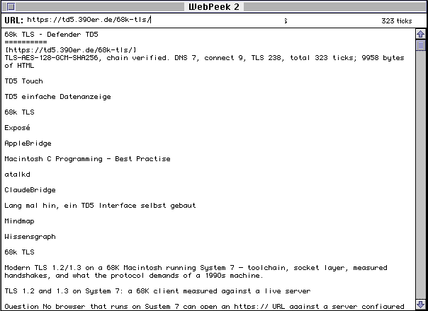
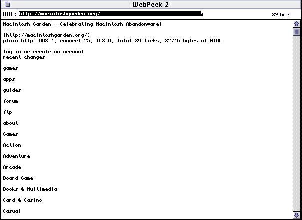

# WebPeek 2 — an `https://` browser for System 7 that needs no gateway

WebPeek 1 (`../webpeek_main.c`, MPW SC) sent a URL to a host-side gateway that did the TLS
and the HTML stripping. WebPeek 2 does all of it on the 68K:

- **Name resolution** — one DNS A-query over UDP through the MacTCP driver API (`tf_resolve`).
  Default server 10.0.2.3, the slirp resolver; `DNS=a.b.c.d` in a `WebPeek Prefs` text file
  beside the application overrides it. Works through Open Transport's MacTCP compatibility.
- **TLS 1.2/1.3** — Crypto Ancienne with the two patches in `mac/httpsget/` (client-side
  HelloRetryRequest; the TLS 1.3 certificate parser fix without which nothing is verified).
  The chain is checked against the 13 roots in `mac/httpsget/roots.h`, the subject against the
  host name. Plain `http://` is fetched without TLS.
- **HTML → text** on the way in (`html2text.c`): script/style/head dropped, title kept, block
  tags become paragraphs, entities decoded, UTF-8 folded to MacRoman through a table generated
  from Python's codec, whitespace collapsed; the first 24 anchors become the **Links** menu.
- **UI** — a location line (type a URL, Return), the page text with a scroll bar (TextEdit,
  so 28 KB of text per page), redirects followed (5 deep), `File ▸ Save Content as PICT`.

Every wait yields through `WaitNextEvent`; the AppleBridge daemon keeps its link while a page
loads, which is how the screenshots here were taken.

## Measured (Basilisk II, 68030 model, System 7.6.1, 2026-08-30)

| Page | DNS | connect | TLS 1.3 (HRR → P-521, chain verified) | total |
|---|---|---|---|---|
| `https://td5.390er.de/68k-tls/` (9958 B) | 7 | 9 | 238 | 323 ticks = 5.4 s |
| `https://td5.390er.de/guide/` via the Links menu (9674 B) | 0 (cached by slirp) | 8 | 236 | 289 ticks = 4.8 s |
| `http://macintoshgarden.org/` typed, plain http (32716 B) | 1 | 25 | — | 89 ticks = 1.5 s |

## Files

| File | Role |
|---|---|
| `webpeek2.c` | the application |
| `tlsfetch.c/.h` | TCP + UDP DNS + TLS + HTTP/1.0 GET with yield/log/sink callbacks — reusable |
| `html2text.c/.h`, `macroman_table.h` | the reducer and its generated character table |
| `webpeek2.r` | SIZE resource (4 MB preferred) |
| `CMakeLists.txt` | Retro68 build; points at `../../../mac/httpsget` for `MacTCP.h`, the shims and the roots |

## Build

Retro68 (see `mac/httpsget/README.md`: no CONSOLE library, `-fno-jump-tables`, patched cryanc):

    cmake -S . -B build -DCRYANC=/path/to/cryanc -DCMAKE_TOOLCHAIN_FILE=…/retro68.toolchain.cmake
    cmake --build build        # build/WebPeek2.bin → mac_put_file → launch_app

## Known issues

- `File ▸ Open URL from Clipboard` answers "Clipboard holds no text" after `mac_clipboard_set`: `GetScrap` returns nothing although the daemon set the scrap. WebPeek 1 had the same code path; not yet investigated.
- `mac_type` at full rate drops characters into the location line (a known bridge trait): type 5 characters per call.

## Traps met while writing it

- The tag buffer in the reducer was not NUL-terminated: a short tag inherited the tail of the
  previous long one (`<title>` read as `titlename=…`), and since `<head>` is skipped and its
  close was never seen, the whole body vanished. Test the reducer natively first — a host build
  of `html2text.c` with a 30-line `main` finds this in seconds; the guest takes a minute per try.
- Multiversal names: `SetControlValue`/`GetControlMaximum`, `inUpButton`/`inThumb`, `CountMItems`;
  no `Controls.h`/`Scrap.h` — everything is in `Multiverse.h`.
- A status line drawn over the location field erases the URL: erase only the status area, then
  `TEUpdate` the field.
